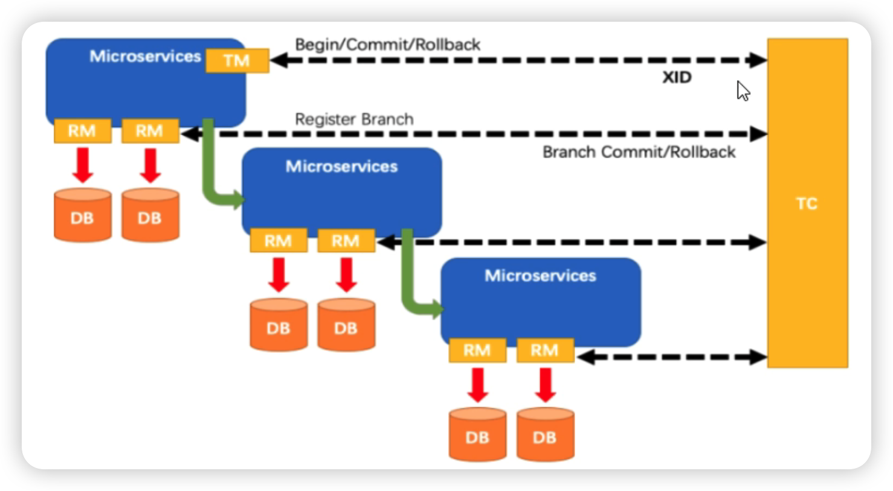

<div style="text-align: center">
    <h1>
    Java学习笔记
    </h1>
</div>

[TOC]


# 一、Java

## 1、Java基础

### 1.1、两个对象的 hashCode() 相同，equals() 不一定 true

### 1.2、Java 容器都有哪些？

分为Collection和Map两大类

-   Collection

    List、ArrayList、LinkedList、Vector、Stack、

    Set、HashSet、LinkedHashSet、TreeSet

-   Map

    Map、HashMap、LinkedHashMap、TreeMap、ConcurrentHashMap、Hashtable

Java集合框架图：


### 1.3、Java中八种数据结构

-   枚举（Enumeration接口）
-   位集合（BitSet类）
-   向量（Vector类）
-   栈（Stack类）
-   字典（Dictionary抽象类）
-   哈希表（Hashtable类）
-   属性（Properties类）

### 1.4、ArrayList、LinkedList 和 Vector 的区别是什么？

-   线程安全：Vector使用了Synchronized来实现线程同步，是线程安全的，而ArrayList和LinkedList是非线程安全的。
-   性能：ArrayList在性能方面要优于Vector。对于链式结构的LinkedList而言，随机添加或删除的性能要优于ArrayList和Vector
-   扩容：ArrayList和Vector都会根据实际的需要动态的调整容量，只不过在 Vector 扩容每次会增加 1 倍，而 ArrayList 只会增加 50%

### 1.5、HashMap、Hashtable、HashSet的区别

-   Hashtable线程安全，HashMap非线程安全
-   HashMap可以使用null作为key，而Hashtable则不允许null作为key
-   HashSet实现了Set接口，它不允许集合中有重复的值，HashMap实现了Map接口，Map接口对键值对进行映射
-   HashSet扩展了HashMap,所以底层还是用到map存储，存储实现同map一致，HashMap储存键值，HashSet存储对象

### 1.6、接口与类的区别

-   接口不能用于实例化对象。接口没有构造方法
-   接口中所有的方法必须是抽象方法
-   接口不能包含成员变量，除了 static 和 final 变量
-   接口不是被类继承了，而是要被类实现。接口支持多继承

### 1.7、迭代器

-   ava.util.Iterator

    Iterator接口是一个专门设计迭代器的

-   java.lang.Iterable

    Iterable接口是专门创建新的迭代器的

    Collection接口继承Iterable接口

### 1.8、Java 泛型

-   泛型方法

    ```java
    public <T> void test(T param){}
    // 只允许传入Comparable及其子类类型
    public <T extends Comparable<T>> void test(T param){}
    ```

-   泛型类

    ```java
    public class A<T>{}
    ```

-   类型通配符

    ```java
    public void test(List<?> param){}
    // 只允许传入Number及其子类类型
    public void test(List<? extend Number> param){}
    ```

    


### 1.9、怎么确保一个集合不能被修改？

可以使用 Collections.unmodifiableCollection(Collection c) 方法来创建一个只读集合，这样改变集合的任何操作都会抛出 Java. lang. UnsupportedOperationException 异常。

```java
Collections.unmodifiableCollection();
Collections.unmodifiableList();
Collections.unmodifiableMap();
Collections.unmodifiableSet();
```

### 1.10、创建线程有哪几种方式？

创建线程有三种方式：

-   继承 Thread 重新 run 方法；
-   实现 Runnable 接口；
-   实现 Callable 接口；

### 1.11、runnable 和 callable 有什么区别？

runnable 没有返回值，callable 可以拿到有返回值

### 1.12、线程有哪些状态？

-   New：新建状态
-   Runnable：可运行状态
-   Running：运行状态
-   Block：阻塞状态
-   Dead：死亡状态


### 1.13、线程池都有哪些状态？

-   Running：接受新的任务，处理等待队列中的任务
-   Shutdown：不接受新的任务提交，但是会继续处理等待队列中的任务
-   Stop：不接受新的任务提交，不再处理等待队列中的任务，中断正在执行任务的线程
-   Tidying：所有的任务都销毁了，workCount 为 0，线程池的状态在转换为 TIDYING 状态时，会执行钩子方法 terminated()
-   Terminaled：terminated()方法结束后，线程池的状态就会变成这个


### 1.14、sleep() 和 wait() 有什么区别？

-   类的不同：sleep() 来自 Thread，wait() 来自 Object。
-   释放锁：sleep() 不释放锁；wait() 释放锁。
-   用法不同：sleep() 时间到会自动恢复；wait() 可以使用 notify()/notifyAll()直接唤醒。

### 1.15、线程池中 submit() 和 execute() 方法有什么区别？

-   execute()：只能执行 Runnable 类型的任务
-   submit()：可以执行 Runnable 和 Callable 类型的任务

Callable 类型的任务可以获取执行的返回值，而 Runnable 执行无返回值。

### 1.16、在 Java 程序中怎么保证多线程的运行安全？

-   使用安全类，比如 Java. util. concurrent 下的类。
-   使用自动锁 synchronized。
-   使用手动锁 Lock。

```java
Lock lock = new ReentrantLock();
lock. lock();
try {
		System. out. println(“获得锁”);
} catch (Exception e) {
		// TODO: handle exception
} finally {
    System. out. println(“释放锁”);
    lock. unlock();
}
```

### 1.17、怎么终止一个线程?

**1、线程自动终止**

-   线程的任务执行完成
-   线程在执行任务过程中发生异常

**2、手动终止**

-   调用Thread类中的stop()方法（不推荐使用）

    这个方法会让线程直接终止，在执行的任务立即终止，未执行的任务无法反馈，所以 stop() 方法已经不建议使用

-   调佣Thread类中的interrupt()方法（推荐使用）

    线程只有从runnable状态才能进入terminated状态。如果线程处于 blocked、waiting、timed_waiting，就需要通过Thread类的interrupt()方法，让线程从休眠状态进入runnable状态，从而结束线程。当线程进入 runnable 状态之后，通过设置一个标识位，线程在合适的时机，检查该标识位，发现符合终止条件，自动退出run()方法，线程终止

    

### 1.18、如何实现对象克隆？

-   实现 Cloneable 接口并重写 Object 类中的 clone() 方法。
-   实现 Serializable 接口，通过对象的序列化和反序列化实现克隆，可以实现真正的深度克隆。

### 1.19、深入讨论-浅拷贝和深拷贝

-   对于数据类型是基本数据类型的成员变量，浅拷贝会直接进行值传递。
-   对于数据类型是引用数据类型的成员变量，那么浅拷贝会进行引用传递。

### 1.20、序列化与反序列化

```java
/**
 * 序列化
 */
@Test
public void serializable() {
    FileOutputStream fos = null;
    ObjectOutputStream oos = null;
    try {
        final Shape shape = new Shape("张三", 12);
        fos = new FileOutputStream("shape.txt");
        oos = new ObjectOutputStream(fos);
        oos.writeObject(shape);
    } catch (IOException e) {
        e.printStackTrace();
    } finally {
        try {
            Objects.requireNonNull(oos).close();
            Objects.requireNonNull(fos).close();
        } catch (IOException e) {
            e.printStackTrace();
        }
    }
}

/**
 * 反序列化
 */
@Test
public void deSerializable() {
    FileInputStream fis = null;
    ObjectInputStream ois = null;
    try {
        fis = new FileInputStream("shape.txt");
        ois = new ObjectInputStream(fis);
        final Shape shape = (Shape) ois.readObject();
        System.out.println(shape);
    } catch (IOException | ClassNotFoundException e) {
        e.printStackTrace();
    } finally {
        try {
            Objects.requireNonNull(ois).close();
            Objects.requireNonNull(fis).close();
        } catch (IOException e) {
            e.printStackTrace();
        }
    }
}
```

### 1.21、创建对象的5种方式

-   **通过 new 关键字**

-   **通过 Class 类的 newInstance() 方法**

　　调用无参构造方法创建对象。比如Person p = (Person) Class.forName("com.cxxwl96.Person").newInstance();

-   **通过 Constructor 类的 newInstance 方法**

　　调用指定某个构造器来创建对象。比如Person p = (Person) Person.class.getConstructors()[0].newInstance();

　　实际上第二种方法利用 Class 的 newInstance() 方法创建对象，其内部调用还是 Constructor 的 newInstance() 方法。

-   **利用 Clone 方法**
-   **反序列化**

## 2、Java web

### 2.1、Web常见的攻击方式

1.  SQL 注入

    使用预处理 PreparedStatement。

    使用正则表达式过滤掉字符中的特殊字符。

2.  XSS 攻击

    跨站脚本攻击。原理是攻击者往 Web 页面里插入恶意的脚本代码（css 代码、Javascript 代码等），当用户浏览该页面时，嵌入其中的脚本代码会被执行，从而达到恶意攻击用户的目的，如盗取用户 cookie、破坏页面结构、重定向到其他网站等。预防 XSS 的核心是必须对输入的数据做过滤处理。

3.  CSRF 攻击

    跨站请求伪造。可以理解为攻击者盗用了你的身份，以你的名义发送恶意请求，比如：以你名义发送邮件、发消息、购买商品，虚拟货币转账等。

    防御手段：

    1、验证请求来源地址；

    2、关键操作添加验证码；

    3、在请求地址添加 token 并验证。

## 3、异常


-   **错误：**

    用来指示运行时环境发生的错误。Java 程序通常不捕获错误。错误一般发生在严重故障时，它们在Java程序处理的范畴之外。例如JVM 内存溢出。一般程序不会从错误中恢复。

-   **检查异常（编译时异常）：**

    继承自`Exception`类。对于检查异常，Java强制我们必须进行处理。对于抛出检查异常的API我们有两种处理方式：

    1、对抛出检查异常的API进程try-catch；

    2、继续把检查异常往上抛。

-   **非检查异常（运行时异常）：**

    继承自`RuntimeException`，所有非检查都有个特点，就是代码不需要处理它们的异常也能通过编译，所以它们称作`非检查异常`。`RuntimeException` 本身也是继承自`Exception`

### 3.1、异常设计

-   **恢复并继续执行：**

    捕获异常，并恢复继续执行程序。捕获了一个异常先尽力恢复，这种情况其实就是在主方案行不通时，用备选方案。

-   **向上传播异常：**

    向上传播就是在本方法上用throws申明，本方法里的代码不对某异常做任何处理。

-   **异常转译：**

    根据设计隔离原则，可以适当修改成异常转译，异常转译就是将一种异常转换为另一种异常。<font color="#CD5A4B">需要注意的是，在对异常进行转译的时候一定要在构造方法中传入原异常的throwable对象，这样可以保留原异常栈信息，而不是把原异常用另一个异常完全替换掉。</font>也可以根据实际情况将一个非检查异常包装成一个检查异常。

-   **改抛为运行时异常：**

    即当捕获到异常时，重新抛出，这跟转译很相似，有一点区别，这里抛的是运行时异常，而转译抛的是编译时异常。

-   **记录并消耗掉异常：**

    把异常记录下来（到日志文件或控制台）然后忽略掉异常，有可能随后就让本方法返回null，这个手法一般用在不是很严重的异常，相当于是warning级别的错误，出现这个异常对程序的执行影响不太。

### 3.2、常见的异常类有哪些？

-   NullPointerException：空指针异常
-   ClassNotFoundException：指定类不存在
-   NumberFormatException：字符串转换为数字异常
-   IndexOutOfBoundsException：数组下标越界异常ClassCastException 数据类型转换异常
-   FileNotFoundException：文件未找到异常
-   NoSuchMethodException：方法不存在异常
-   IOException：IO 异常
-   SocketException：Socket 异常

## 4、网络

### 4.1、 OSI 的七层模型都有哪些？

-   物理层：利用传输介质为数据链路层提供物理连接，实现比特流的透明传输。
-   数据链路层：负责建立和管理节点间的链路。
-   网络层：通过路由选择算法，为报文或分组通过通信子网选择最适当的路径。
-   传输层：向用户提供可靠的端到端的差错和流量控制，保证报文的正确传输。
-   会话层：向两个实体的表示层提供建立和使用连接的方法。
-   表示层：处理用户信息的表示问题，如编码、数据格式转换和加密解密等。
-   应用层：直接向用户提供服务，完成用户希望在网络上完成的各种工作。

### 4.2、实现跨域的几种方案

-   服务器端运行跨域 设置 CORS 等于 *；
-   在单个接口使用注解 @CrossOrigin 运行跨域；
-   使用 jsonp 跨域；

## 5、设计模式

<a href="https://github.com/cxxwl96/design-pattern"></img>代码仓库地址</a>

### 5.1、常用的设计模式

-   **创建性模式：**

    单例模式、工厂模式、抽象工厂模式、建造者模式、原型模式

-   **结构型模式：**

    适配器模式、桥接模式、装饰模式、组合模式、外观模式、享元模式，代理模式

-   **行为型模式：**

    模板模式、命令模式、访问者模式、迭代器模式、观察者模式、中介者模式、备忘录模式、解释器模式、状态模式、策略模式、职责链模式

### 5.2、设计模式的七大原则

-   单一职责原则
-   接口隔离原则
-   依赖倒转（倒置）原则
-   里氏替换原则
-   开闭原则（OCP）
-   迪米特法则
-   合成复用原则

### 5.3、设计模式

#### 《创建性模式》

#### 5.3.1、单例模式 (<font color="red"> * </font>)

单单例模式有八种方式：

1.  **饿汉式（静态常量）**

    ```java
    /**
     * 饿汉式（静态常量）
     */
    public class Singleton1 {
        // 直接创建
        private static final Singleton1 instance = new Singleton1();
    
        private Singleton1() {
        }
    
        public static Singleton1 getInstance() {
            return instance;
        }
    }
    ```

    优缺点说明：
    优点：在类装载的时候就完成实例化。避免了线程同步问题。
    缺点：在类装载的时候就完成实例化，没有达到Lazy Loading的效果。如果从始至终从未使用过这个实例，则会造成内存的浪费
    结论：这种单例模式可用，可能造成内存浪费

2.  **饿汉式（静态代码块）**

    ```java
    /**
     * 饿汉式（静态代码块）
     */
    public class Singleton2 {
        private static final Singleton2 instance;
    
        static {
            // 静态代码块中创建
            instance = new Singleton2();
        }
    
        private Singleton2() {
        }
    
        public static Singleton2 getInstance() {
            return instance;
        }
    }
    ```

    优缺点说明：这种方式和上面的方式其实类似，只不过将类实例化的过程放在了静态代码块中

3.  **懒汉式（线程不安全）**

    ```java
    /**
     * 懒汉式（线程不安全）
     */
    public class Singleton3 {
        private static Singleton3 instance;
    
        private Singleton3() {
        }
    
        public static Singleton3 getInstance() {
            // 获取实例时才创建
            if (instance == null) {
                instance = new Singleton3();
            }
            return instance;
        }
    }
    ```

    优缺点说明：
    1)起到了Lazy Loading的效果，但是只能在单线程下使用。
    2)如果在多线程下，一个线程进入了H (singleton =- nul)判断语句块，还未来得及往下热行，另一个线程也通过了这个判断语句，这时便会产生多个实例。所以在多线程环境下不可使用这种方式
    3)结论：在实际开发中，不要使用这种方式.

4.  **懒汉式（线程安全，同步方法）**

    ```java
    /**
     * 懒汉式（线程安全，同步方法）
     */
    public class Singleton4 {
        private static Singleton4 instance;
    
        private Singleton4() {
        }
    
        // 添加同步
        public static synchronized Singleton4 getInstance() {
            // 获取实例时才创建
            if (instance == null) {
                instance = new Singleton4();
            }
            return instance;
        }
    }
    ```

    优缺点说明：
    1)解决了线程不安全问题
    2)效率太低了，每个线程在想获得类的实例时候，执行getinstance()方法都要进行同步。而其实这个方法只执行一次实例化代码就够了，后面的想获得该类买例，直接return就行了。方法进行同步效率太低
    3)结论：在实际开发中，不推荐使用这种方式

5.  **懒汉式（线程不安全，同步代码块）**

    ```java
    /**
     * 懒汉式（线程安全，同步代码块）
     */
    public class Singleton5 {
        private static Singleton5 instance;
        
        private Singleton5() {
        }
    
        public static Singleton5 getInstance() {
            // 获取实例时才创建
            if (instance == null) {
                // 添加同步,实际上无意义，当线程进入if，该实例就会被多次创建，并非单例了
                // 实际开发中不能这样使用
                synchronized (Singleton5.class) {
                    instance = new Singleton5();
                }
            }
            return instance;
        }
    }
    ```

    优缺点说明：
    1)这种方式，本意是想对第四种实现方式的改进，因为前面同步方法效率太低，改为同步产生实例化的的代码块
    2)但是这种同步并不能起到线程同步的作用。跟第3种实现方式遇到的情形一致，假如一个线程进入了if (singleton == nul)判断语句块，还未来得及往下执行，另一个线程也通过了这个判断语句，这时便会产生多个实例
    3)结论：在实际开发中，<font color="red">不能使用这种方式</font>

6.  **双重检查（推荐使用）**

    ```java
    /**
     * 双重检查（推荐使用）
     */
    public class Singleton6 {
        private static volatile Singleton6 instance;
    
        private Singleton6() {
        }
    
        public static Singleton6 getInstance() {
            // 首次检查
            if (instance == null) {
                // 添加同步
                synchronized (Singleton6.class) {
                    // 再次检查
                    if (instance==null) {
                        instance = new Singleton6();
                    }
                }
            }
            return instance;
        }
    }
    ```

    优缺点说明：

    1）Double-Check概念是多线程开发中常使用到的，如代码中所示，我们进行了两
    次if (singleton == nul)检查，这样就可以保证线程安全了。

    2）这样，实例化代码只用执行一次，后面再次访问时，判断if (singleton == nul)，
    直接return实例化对象，也避免的反复进行方法同步.
    3）线程安全；延迟加载：效率较高
    4）结论：在实际开发中，推荐使用这种单例设计模式

7.  **静态内部类（推荐使用）**

    ```java
    /**
     * 静态内部类
     */
    public class Singleton7 {
        private Singleton7() {
        }
    
        /**
         * 当类加载器加载外部类的时候，静态内部类是不会被加载的，只有当静态内部类第一次使用时才会被加载
         * 类被加载的时候是线程安全的，所以不用考虑线程安全问题
         */
        private static class SingletonInner {
            private static final Singleton7 INSTANCE = new Singleton7();
        }
    
        public static Singleton7 getInstance() {
            return SingletonInner.INSTANCE;
        }
    }
    ```

    优缺点说明：
    1）这种方式采用了类装载的机制来保证初始化实例时只有一个线程。

    2）静态内部类方式在Singleton类被装载时并不会立即实例化，而是在需要实例化时，调用getinstance方法，才会装载SingletonInstance类，从而完成Singleton的实例化。
    3）类的静态属性只会在第一次加载类的时候初始化，所以在这里，JVM帮助我们保证了线程的安全性，在类进行初始化时，别的线程是无法进入的。优点：避免了线程不安全，利用静态内部类特点实现延迟加载，效率高
    结论：推荐使用

8.  **枚举（推荐使用）**

    ```java
    /**
     * 枚举
     */
    public enum Singleton8 {
        INSTANCE;
    
        public void method() {
            System.out.println("do other things...");
        }
    }
    ```

    优缺点说明：
    1）这借助JDK1.5中添加的枚举来实现单例模式。不仅能避免多线程同步问题，而且还能防止反序列化重新创建新的对象。
    2）这种方式是Effective Java作者Josh Bloch 提倡的方式
    3）结论：推荐使用

#### 5.3.2、工厂模式 (<font color="red"> * </font>)

1.  **简单工厂模式**

    ```java
    public interface Shape {
        void draw();
    }
    public class Rectangle implements Shape {
        @Override
        public void draw() {
            System.out.println("draw rectangle");
        }
    }
    public class Square implements Shape {
        @Override
        public void draw() {
            System.out.println("draw square");
        }
    }
    public class Circle implements Shape {
        @Override
        public void draw() {
            System.out.println("draw circle");
        }
    }
    public class SimpleFactory {
        public Shape getShape(String shapeStr) {
            switch (shapeStr) {
                case "rectangle":
                    return new Rectangle();
                case "square":
                    return new Square();
                case "circle":
                    return new Circle();
                default:
                    return null;
            }
        }
    }
    public class FactoryTest {
        @Test
        public void test() {
            final SimpleFactory factory = new SimpleFactory();
            factory.getShape("rectangle").draw();
            factory.getShape("square").draw();
            factory.getShape("circle").draw();
        }
    }
    ```

    

2.  **工厂方法模式**

    ```java
    
    ```

    

#### 5.3.3、抽象工厂模式

```java
public interface Shape {
    void draw();
}
public class Rectangle implements Shape {
    @Override
    public void draw() {
        System.out.println("draw rectangle");
    }
}
public class Square implements Shape {
    @Override
    public void draw() {
        System.out.println("draw square");
    }
}
public class Circle implements Shape {
    @Override
    public void draw() {
        System.out.println("draw circle");
    }
}
public interface Color {
    void full();
}
public class Red implements Color{
    @Override
    public void full() {
        System.out.println("full red");
    }
}
public class Green implements Color{
    @Override
    public void full() {
        System.out.println("full green");
    }
}
public class Blue implements Color{
    @Override
    public void full() {
        System.out.println("full blue");
    }
}
public class ShapeFactory {
    public Shape getShape(String shapeStr) {
        switch (shapeStr) {
            case "rectangle":
                return new Rectangle();
            case "square":
                return new Square();
            case "circle":
                return new Circle();
            default:
                return null;
        }
    }
}
public class ColorFactory {
    Color getColor(String colorStr) {
        switch (colorStr) {
            case "red":
                return new Red();
            case "green":
                return new Green();
            case "blue":
                return new Blue();
            default:
                return null;
        }
    }
}
/**
 * 抽象工厂模式
 */
public class AbstractFactory {
    public ShapeFactory getShapeFactory() {
        return new ShapeFactory();
    }

    public ColorFactory getColorFactory() {
        return new ColorFactory();
    }
}
public class FactoryTest {
    @Test
    public void test() {
        final AbstractFactory abstractFactory = new AbstractFactory();
        final ShapeFactory shapeFactory = abstractFactory.getShapeFactory();
        final ColorFactory colorFactory = abstractFactory.getColorFactory();
        shapeFactory.getShape("rectangle").draw();
        shapeFactory.getShape("square").draw();
        shapeFactory.getShape("circle").draw();
        colorFactory.getColor("red").full();
        colorFactory.getColor("blue").full();
        colorFactory.getColor("green").full();
    }
}
```


#### 5.3.4、原型模式 (<font color="red"> * </font>)

原型模式(Prototype模式}是指：用原型实例指定创建对象的种类，并且通过拷贝这些原型，创建新的对象

```java
/**
 * 原型模式
 *
 * @author cxxwl96
 * @since 2022/3/28 21:52
 */
@Data
@AllArgsConstructor
public class Shape implements Cloneable {
    private String name;

    private int age;
    
    @Override
    protected Object clone() throws CloneNotSupportedException {
        return super.clone();
    }
}
public class ShapeTest {
    @Test
    public void test() {
        try {
            final Shape shape = new Shape("多莉", 24);
            final Shape shape1 = (Shape) shape.clone();
            System.out.println(shape == shape1); // false
            System.out.println(shape);
            System.out.println(shape1);
        } catch (CloneNotSupportedException e) {
            e.printStackTrace();
        }
    }
}
```

```tex
false
Shape(name=多莉, age=24)
Shape(name=多莉, age=24)
```

在spring的getBean中，当Scope=prototype的时候使用的就是原型模式

#### 5.3.5、建造者模式 (<font color="red"> * </font>)

建造者模式(BuilderPattern）又叫`生成器模式`，是一种对象构建模式。它可以将复杂对象的建造过程抽象出来（抽象类别），使这个抽象过程的不同实现方法可以构造出不同表现（属性）的对象。建造者模式是一步一步创建一个复杂的对家，它允许用户只通过指定复杂对象的类型和内容就可以构建它们，用户不需要知道内部的具体构建细节。

建造者模式的四个角色：

-   Product（产品角色）：一个具体的产品对象。
-   Builder（抽象建造者）：创建一个Product对象的各个部件指定的接口。
-   ConcreteBuilder（具体建造者）：实现接口，构建和装配各个部件。
-   Director（指挥者）：构建一个使用Builder接口的对象。它主要是用于创建一个复杂的对象。它主要有两个作用，一是：隔离了客户与对象的生产过程，二是：负责控制产品对象的生产过程。

```java
/**
 * 产品
 */
@Data
public class House {
    // 地基
    private String foundation;

    // 墙
    private String wall;

    // 房顶
    private String roof;
}
/**
 * 抽象建造者
 */
public abstract class AbstractHouseBuilder {
    protected final House house = new House();

    /**
     * 打地基
     */
    protected abstract void buildFoundation();

    /**
     * 砌墙
     */
    protected abstract void buildWall();

    /**
     * 封顶
     */
    protected abstract void buildRoof();

    protected House build() {
        return house;
    }
}
/**
 * 具体建造者
 */
public class CommonHouse extends AbstractHouseBuilder{
    /**
     * 打地基
     */
    @Override
    protected void buildFoundation() {
        house.setFoundation("普通房子：打地基");
    }

    /**
     * 砌墙
     */
    @Override
    protected void buildWall() {
        house.setWall("普通房子：砌墙");
    }

    /**
     * 封顶
     */
    @Override
    protected void buildRoof() {
        house.setRoof("普通房子：封顶");
    }
}
/**
 * 具体建造者
 */
public class HightHouse extends AbstractHouseBuilder {
    /**
     * 打地基
     */
    @Override
    protected void buildFoundation() {
        house.setFoundation("高楼：打地基");
    }

    /**
     * 砌墙
     */
    @Override
    protected void buildWall() {
        house.setWall("高楼：砌墙");
    }

    /**
     * 封顶
     */
    @Override
    protected void buildRoof() {
        house.setRoof("高楼：封顶");
    }
}
/**
 * 指挥者
 */
public class HouseDirector {
    private final AbstractHouseBuilder builder;

    public HouseDirector(AbstractHouseBuilder builder) {
        this.builder = builder;
    }

    public House director() {
        // 打地基
        builder.buildFoundation();
        // 砌墙
        builder.buildWall();
        // 封顶
        builder.buildRoof();
        return builder.build();
    }
}
public class BuilderTest {
    @Test
    public void test() {
        final HouseDirector commonDirector = new HouseDirector(new CommonHouse());
        final HouseDirector hightDirector = new HouseDirector(new HightHouse());
        final House commonHouse = commonDirector.director();
        final House hightHouse = hightDirector.director();
        System.out.println(commonHouse); // House(foundation=普通房子：打地基, wall=普通房子：砌墙, roof=普通房子：封顶)
        System.out.println(hightHouse); // House(foundation=高楼：打地基, wall=高楼：砌墙, roof=高楼：封顶)
    }
}
```

>   JDK中的StringBuilder使用了建造者模式

#### 《结构型模式》

#### 5.3.6、适配器模式 (<font color="red"> * </font>)

适配器模式(Adapter Pattern)将某个类的接口转换成客户端期望的另一个接口表示，主的目的是兼容性，让原本因接口不匹配不能一起工作的两个类可以协同工作。其别名为包装器（Wrapper）

适配器模式主要分为三类：类适配器模式、对象适配器模式、接口适配器模式

-   **类适配器模式**

```java
public class Voltage220V {
    public int output() {
        System.out.println("输出220V电压");
        return 220;
    }
}
public interface IVoltage5V {
    int output();
}
/**
 * 类适配器模式
 */
public class VoltageAdapter extends Voltage220V implements IVoltage5V {
    @Override
    public int output() {
        final int voltage = super.output() / 44;
        System.out.println("转换输出电压" + voltage + "V电压");
        return voltage;
    }
}
public class VoltageAdapterTest {
    @Test
    public void test(){
        final VoltageAdapter adapter = new VoltageAdapter();
        System.out.println(adapter.output());
    }
}
```

```tex
输出220V电压
转换输出电压5V电压
5
```

类适配器需要继承src类这一点算是一个缺点，因为这要求目标必须是接口，有一定局限性

-   **对象适配器模式**（常用）

```java
public class Voltage220V {
    public int output() {
        System.out.println("输出220V电压");
        return 220;
    }
}
public interface IVoltage5V {
    int output();
}
/**
 * 对象适配器模式
 */
public class VoltageAdapter implements IVoltage5V {
    private final Voltage220V voltage220V;

    public VoltageAdapter(Voltage220V voltage220V) {
        this.voltage220V = voltage220V;
    }

    @Override
    public int output() {
        final int voltage = voltage220V.output() / 44;
        System.out.println("转换输出电压" + voltage + "V电压");
        return voltage;
    }
}
public class VoltageAdapterTest {
    @Test
    public void test(){
        final VoltageAdapter adapter = new VoltageAdapter(new Voltage220V());
        System.out.println(adapter.output());
    }
}
```

```tex
输出220V电压
转换输出电压5V电压
5
```

-   **接口适配器模式**

```java
public class Voltage220V {
    public int output() {
        System.out.println("输出220V电压");
        return 220;
    }
}
public interface IVoltage {
    int output5v(Voltage220V voltage220V);

    int output20v(Voltage220V voltage220V);
}
/**
 * 接口适配器模式
 */
public abstract class Voltage5VAdapter implements IVoltage {
    /**
     * 保留需要适配接口的方法
     */
    @Override
    public abstract int output5v(Voltage220V voltage220V);

    @Override
    public int output20v(Voltage220V voltage220V) {
        return 0;
    }
}
public class Voltage5VAdapterTest {
    @Test
    public void test() {
        final Voltage5VAdapter adapter = new Voltage5VAdapter() {
            @Override
            public int output5v(Voltage220V voltage220V) {
                final int voltage = voltage220V.output() / 44;
                System.out.println("转换输出电压" + voltage + "V电压");
                return voltage;
            }
        };
        System.out.println(adapter.output5v(new Voltage220V()));
    }
}
```

```tex
输出220V电压
转换输出电压5V电压
5
```

#### 5.3.7、桥接模式 (<font color="red"> * </font>)

桥接模式(Bridge模式)是指：将实现与抽象放在两个不同的类层次中，使两个层次可以独立改变。

Bridge模式基于类的最小设计原则，通过使用封装、聚合及继承等行为让不同的类手担不同的职责。它的主要特点是把抽象(Abstraction)与行为实现(Implementation)分高开来，从而可以保持各部分的独立性以及应对他们的功能扩展

图形与颜色两种类型进行组合：


```java
public interface Color {
    String getName();
}
public class RedColor implements Color{
    @Override
    public String getName() {
        return "红色";
    }
}
public class BlueColor implements Color{
    @Override
    public String getName() {
        return "蓝色";
    }
}
public abstract class Shape {
    private final Color color;

    public Shape(Color color) {
        this.color = color;
    }

    public Color getColor() {
        return color;
    }
}
/**
 * 桥接模式
 */
public class Circle extends Shape {
    public Circle(Color color) {
        super(color);
    }

    public void draw() {
        System.out.printf("画一个%s的圆形\n", getColor().getName());
    }
}
public class Rectangle extends Shape {
    public Rectangle(Color color) {
        super(color);
    }

    public void draw() {
        System.out.printf("画一个%s的矩形\n", getColor().getName());
    }
}
public class BridgeTest {
    @Test
    public void test() {
        final Circle blueCircle = new Circle(new BlueColor());
        final Circle redCircle = new Circle(new RedColor());
        final Rectangle blueRectangle = new Rectangle(new BlueColor());
        final Rectangle redRectangle = new Rectangle(new RedColor());
        blueCircle.draw();
        redCircle.draw();
        blueRectangle.draw();
        redRectangle.draw();
    }
}
```

```tex
画一个蓝色的圆形
画一个红色的圆形
画一个蓝色的矩形
画一个红色的矩形
```

#### 5.3.8、装饰模式

```java
@Data
public abstract class Drink {
    private String des;

    private float price;

    public abstract float cost();
}
public class Coffee extends Drink{
    @Override
    public float cost() {
        return super.getPrice();
    }
}
public class EspressoCoffee extends Coffee {
    public EspressoCoffee() {
        setPrice(5.0f);
        setDes("意大利咖啡");
    }
}
public class LatteCoffee extends Coffee {
    public LatteCoffee() {
        setPrice(6.0f);
        setDes("拿铁咖啡");
    }
}
/**
 * 装饰者模式
 */
public abstract class Decorator extends Drink {
    private final Drink drink;

    public Decorator(Drink drink) {
        this.drink = drink;
    }

    @Override
    public float cost() {
        return super.getPrice() + drink.cost();
    }

    @Override
    public void setDes(String des) {
        final String format = String.format("[%s(%.2f) + %s(%.2f)]", drink.getDes(), drink.cost(), des, super.getPrice());
        super.setDes(format);
    }
}
public class Chocolate extends Decorator {
    public Chocolate(Drink drink) {
        super(drink);
        super.setPrice(3.0f);
        super.setDes("巧克力");
    }
}
public class Milk extends Decorator {
    public Milk(Drink drink) {
        super(drink);
        setPrice(1.5f);
        setDes("牛奶");
    }
}
public class DecoratorTest {
    @Test
    public void test() {
        Drink drink = new EspressoCoffee();
        System.out.printf("%s = %.2f\n", drink.getDes(), drink.cost());
        drink = new Chocolate(drink);
        System.out.printf("%s = %.2f\n", drink.getDes(), drink.cost());
        drink = new Milk(drink);
        System.out.printf("%s = %.2f\n", drink.getDes(), drink.cost());
        drink = new Milk(drink);
        System.out.printf("%s = %.2f\n", drink.getDes(), drink.cost());
    }
}
```

```tex
意大利咖啡 = 5.00
[意大利咖啡(5.00) + 巧克力(3.00)] = 8.00
[[意大利咖啡(5.00) + 巧克力(3.00)](8.00) + 牛奶(1.50)] = 9.50
[[[意大利咖啡(5.00) + 巧克力(3.00)](8.00) + 牛奶(1.50)](9.50) + 牛奶(1.50)] = 11.00
```


#### 5.3.9、组合模式 (<font color="red"> * </font>)

适用于树形结构的层级关系

```java
@Data
public abstract class Organization {
    private final String name;

    protected Organization(String name) {
        this.name = name;
    }

    public void add(Organization organization) {
        throw new UnsupportedOperationException();
    }

    public abstract void print();
}
/**
 * 大学
 */
public class University extends Organization {
    private List<Organization> orgs = new ArrayList<>();

    public University(String name) {
        super(name);
    }

    @Override
    public void add(Organization organization) {
        orgs.add(organization);
    }

    @Override
    public void print() {
        System.out.println("-----------" + super.getName() + "----------");
        for (Organization org : orgs) {
            org.print();
        }
    }
}
/**
 * 学院
 */
public class College extends Organization {
    private List<Organization> orgs = new ArrayList<>();

    public College(String name) {
        super(name);
    }

    @Override
    public void add(Organization organization) {
        orgs.add(organization);
    }

    @Override
    public void print() {
        System.out.println("---" + super.getName() + "---");
        for (Organization org : orgs) {
            org.print();
        }
    }
}
/**
 * 专业
 */
public class Department extends Organization {
    protected Department(String name) {
        super(name);
    }

    @Override
    public void print() {
        System.out.println(getName());
    }
}
public class CompositeTest {
    @Test
    public void test() {
        final University university = new University("清华大学");
        final College college1 = new College("计算机学院");
        final College college2 = new College("信息工程学院");
        final Department department1 = new Department("软件工程");
        final Department department2 = new Department("网络工程");
        final Department department3 = new Department("计算机与科学技术");
        final Department department4 = new Department("通信工程");
        final Department department5 = new Department("信息工程");
        college1.add(department1);
        college1.add(department2);
        college1.add(department3);
        college2.add(department4);
        college2.add(department5);
        university.add(college1);
        university.add(college2);
        university.print();
    }
}
```

```tex
-----------清华大学----------
---计算机学院---
软件工程
网络工程
计算机与科学技术
---信息工程学院---
通信工程
信息工程
```


#### 5.3.10、外观模式

外观模式可以理解为转换一群接口，客户只要调用一个接口，而不用调用多个接口才能达到目的。比如：在pc上安装软件的时候经常有一键安装选项（省去选择安装目录、安装的组件等等），还有就是手机的重启功能(把关机和启动合为一个操作)。

外观模式就是解决多个复杂接口带来的使用困难，起到简化用户操作的作用

```java
public class DVDPlayer { ... }
public class Popcorn { ... }
public class Projector { ... }
public class Screen { ... }
public class Stereo { ... }
public class TheaterLight { ... }
/**
 * 外观模式解决家庭影院流程复杂问题
 */
public class HomeTheaterFacade {
    // 影院灯光
    private final TheaterLight theaterLight;

    // 爆米花机
    private final Popcorn popcorn;

    // 立体声
    private final Stereo stereo;

    // 投影仪
    private final Projector projector;

    // 屏幕
    private final Screen screen;

    // 播放器
    private final DVDPlayer dvdPlayer;

    public HomeTheaterFacade() {
        this.theaterLight = TheaterLight.getInstance();
        this.popcorn = Popcorn.getInstance();
        this.stereo = Stereo.getInstance();
        this.projector = Projector.getInstance();
        this.screen = Screen.getInstance();
        this.dvdPlayer = DVDPlayer.getInstance();
    }

    public void ready() {
        // 打开影院灯光
        theaterLight.on();
        // 打开爆米花机
        popcorn.on();
        // 制作爆米花
        popcorn.pop();
        // 屏幕下降
        screen.down();
        // 打开投影仪
        projector.on();
        // 投影仪聚焦
        projector.focus();
        // 打开立体声
        stereo.on();
        // 打开播放器
        dvdPlayer.on();
        // 调暗影院灯光
        theaterLight.dim();
    }

    public void play() {
        // 播放电影...
        dvdPlayer.play();
    }

    public void pause() {
        // 暂停播放
        dvdPlayer.pause();
    }

    public void end() {
        // 关闭爆米花机
        popcorn.off();
        // 调亮影院灯光
        theaterLight.bright();
        // 屏幕上升
        screen.up();
        // 关闭投影仪
        projector.off();
        // 关闭立体声
        stereo.off();
        // 关闭播放器
        dvdPlayer.off();
        // 关闭影院灯光
        theaterLight.off();
    }
}
public class FacadeTest {
    @Test
    public void test() {
        final HomeTheaterFacade facade = new HomeTheaterFacade();
        System.out.println("==========准备工作=========");
        facade.ready();
        System.out.println("==========开始播放=========");
        facade.play();
        System.out.println("==========暂停播放=========");
        facade.pause();
        System.out.println("==========结束播放=========");
        facade.end();
    }
}
```

```tex
==========准备工作=========
打开影院灯光
打开爆米花机
制作爆米花
屏幕下降
打开投影仪
投影仪聚焦
打开立体声
打开播放器
调暗影院灯光
==========开始播放=========
播放电影...
==========暂停播放=========
暂停播放
==========结束播放=========
关闭爆米花机
调亮影院灯光
屏幕上升
关闭投影仪
关闭立体声
关闭播放器
关闭影院灯光
```

#### 5.3.11、享元模式 (<font color="red"> * </font>)

享元模式 (Flyweight Pattern） 也叫蝇量模式：运用共享技术有效地支持大量细粒度的对象。

常用于系统底层开发，解决系统的性能问题。像数据库连接池，里面都是创建好的连接对象，在这些连接对象中有我们需要的则直接拿来用，避免重新创建，如果没有我们需要的，则创建一个。

享元模式能够解决重复对象的内存浪费的问题，当系统中有大量相似对象，需要缓冲池时。不需总是创建新对象，可以从緩冲池里拿。这样可以降低系统内存，同时提高效率。

享元模式经典的应用场景就是池技术了，String常量池、数据库连接池、緩冲池等等都是享元模式的应用，享元模式是池技术的重要实现方式。

```java
public interface WebSite {
    void use(String user);
}
public class ConcreteWeSite implements WebSite {
    public final String type;

    public ConcreteWeSite(String type) {
        this.type = type;
    }

    @Override
    public void use(String user) {
        System.out.printf("网站类型：%s, %s正在使用\n", type, user);
    }
}
/**
 * 享元模式
 */
public class WebSiteFactory {
    private final Map<String, WebSite> pool = new HashMap<>();

    public WebSite getConcreteWebSite(String type) {
        if (!pool.containsKey(type)) {
            final ConcreteWeSite webSite = new ConcreteWeSite(type);
            pool.put(type, webSite);
            return webSite;
        }
        return pool.get(type);
    }
}
public class FlyWeightTest {
    @Test
    public void test() {
        final WebSiteFactory factory = new WebSiteFactory();
        factory.getConcreteWebSite("博客").use("张三");
        factory.getConcreteWebSite("新闻").use("李四");
        factory.getConcreteWebSite("新闻").use("王五");
        factory.getConcreteWebSite("新闻").use("赵六");
    }
}
```

```tex
网站类型：博客, 张三正在使用
网站类型：新闻, 李四正在使用
网站类型：新闻, 王五正在使用
网站类型：新闻, 赵六正在使用
```


#### 5.3.12、代理模式 (<font color="red"> * </font>)

-   代理模式：为一个对象提供一个替身，以控制对这个对象的访问。即通过代理对象访问目标对象.这样做的好处是:可以在目标对象实现的基础上,增强额外的功能操作,即扩展目标对象的功能。

-   被代理的对象可以是远程对象、创建开销大的对象或需要安全控制的对象

-   代理模式有不同的形式，主要有三种静态代理、动态代理和Cglib代理。

1.  **静态代理**

    ```java
    public interface IService {
        void add();
    }
    public class ServiceImpl implements IService{
        @Override
        public void add() {
            System.out.println("add...");
        }
    }
    /**
     * 静态代理
     */
    public class ServiceProxy implements IService {
        private final IService iService;
    
        public ServiceProxy(IService iService) {
            this.iService = iService;
        }
    
        @Override
        public void add() {
            System.out.println("before");
            iService.add();
            System.out.println("after");
        }
    }
    public class StaticProxyTest {
        @Test
        public void test() {
            final IService service = new ServiceImpl();
            final ServiceProxy proxyService = new ServiceProxy(service);
            proxyService.add();
        }
    }
    ```

    ```tex
    before
    add...
    after
    ```

    

2.  **动态代理**

    ```java
    public interface IService {
        void add();
    }
    public class ServiceImpl implements IService{
        @Override
        public void add() {
            System.out.println("add...");
        }
    }
    /**
     * 动态代理
     */
    public class ServiceProxy implements InvocationHandler {
        private final Object obj;
    
        public ServiceProxy(Object obj) {
            this.obj = obj;
        }
    
        @Override
        public Object invoke(Object proxy, Method method, Object[] args) throws Throwable {
            System.out.println("before");
            // 如果调用的方法没有返回值，则method.getReturnType().getName()为void，method.invoke()返回null
            final Object result = method.invoke(obj, args);
            System.out.println("after");
            return result;
        }
    }
    public class DynamicProxyTest {
        @Test
        public void test() {
            final ClassLoader classLoader = DynamicProxyTest.class.getClassLoader();
            Class<?>[] interfaces = new Class<?>[] {IService.class};
            final ServiceProxy handler = new ServiceProxy(new ServiceImpl());
            final IService service = (IService) Proxy.newProxyInstance(classLoader, interfaces, handler);
            service.add();
        }
    }
    ```

    ```tex
    before
    add...
    after
    ```

    

3.  **CGLib代理**

    ```java
    public class MyService {
        public void add() {
            System.out.println("add...");
        }
    }
    /**
     * CGLib动态代理
     */
    public class ServiceProxy implements MethodInterceptor {
        @Override
        public Object intercept(Object obj, Method method, Object[] args, MethodProxy proxy) throws Throwable {
            System.out.println("before");
            final Object result = proxy.invokeSuper(obj, args);
            System.out.println("after");
            return result;
        }
    }
    public class CGLibProxyTest {
        @Test
        public void test() {
            final Enhancer enhancer = new Enhancer();
            enhancer.setSuperclass(MyService.class);
            enhancer.setCallback(new ServiceProxy());
            final MyService service = (MyService) enhancer.create();
            service.add();
        }
    }
    ```

    ```te
    before
    add...
    after
    ```

    

#### 《行为型模式》

#### 5.3.13、模板方法模式（模板模式） (<font color="red"> * </font>)

```java
/**
 * 豆浆
 */
public abstract class SoybeanMilk {
    public final void make() {
        this.select();
        if (this.isAddCondiments()) {
            this.addCondiments();
        }
        this.soak();
        this.beat();
    }

    private void select() {
        System.out.println("选择黄豆");
    }

    protected abstract void addCondiments();

    protected boolean isAddCondiments() {
        return true;
    }

    private void soak() {
        System.out.println("浸泡");
    }

    private void beat() {
        System.out.println("打磨");
    }
}
public class RedSoybeanMilk extends SoybeanMilk{
    @Override
    protected void addCondiments() {
        System.out.println("添加红豆");
    }
}
public class GreenSoybeanMilk extends SoybeanMilk{
    @Override
    protected void addCondiments() {
        System.out.println("添加绿豆");
    }
}
public class PureSoybeanMilk extends SoybeanMilk{
    @Override
    protected void addCondiments() {
    }

    @Override
    protected boolean isAddCondiments() {
        return false;
    }
}
public class TemplateTest {
    @Test
    public void test() {
        System.out.println("=====制作红豆豆浆=====");
        new RedSoybeanMilk().make();
        System.out.println("=====制作绿豆豆浆=====");
        new GreenSoybeanMilk().make();
        System.out.println("=====制作纯豆浆=====");
        new PureSoybeanMilk().make();
    }
}
```

```tex
=====制作红豆豆浆=====
选择黄豆
添加红豆
浸泡
打磨
=====制作绿豆豆浆=====
选择黄豆
添加绿豆
浸泡
打磨
=====制作纯豆浆=====
选择黄豆
浸泡
打磨
```


#### 5.3.14、命令模式

```java
public class LightReceiver {
    public void on() {
        System.out.println("点灯打开了。。。");
    }

    public void off() {
        System.out.println("点灯关闭了。。。");
    }
}
public interface Command {
    /**
     * 执行命令
     */
    void execute();

    /**
     * 撤销命令
     */
    void undo();
}
public class NoCommand implements Command {
    @Override
    public void execute() {
    }

    @Override
    public void undo() {
    }
}
public class LightOnCommand implements Command {
    private final LightReceiver receiver;

    public LightOnCommand(LightReceiver receiver) {
        this.receiver = receiver;
    }

    @Override
    public void execute() {
        receiver.on();
    }

    @Override
    public void undo() {
        receiver.off();
    }
}
public class LightOffCommand implements Command {
    private final LightReceiver receiver;

    public LightOffCommand(LightReceiver receiver) {
        this.receiver = receiver;
    }

    @Override
    public void execute() {
        receiver.off();
    }

    @Override
    public void undo() {
        receiver.on();
    }
}
/**
 * 命令模式
 */
public class RemoteController {
    private final Command[] onCommands;

    private final Command[] offCommands;

    private Command undoCommand = new NoCommand();

    public RemoteController() {
        int len = 5;
        onCommands = new Command[len];
        offCommands = new Command[len];
        for (int i = 0; i < len; i++) {
            onCommands[i] = new NoCommand();
            offCommands[i] = new NoCommand();
        }
    }

    public void setCommand(int index, Command onCommand, Command offCommand) {
        onCommands[index] = onCommand;
        offCommands[index] = offCommand;
    }

    public void onButton(int index) {
        onCommands[index].execute();
        undoCommand = onCommands[index];
    }

    public void offButton(int index) {
        offCommands[index].execute();
        undoCommand = offCommands[index];
    }

    public void undo() {
        undoCommand.undo();
    }

}
public class CommandTest {
    @Test
    public void test() {
        final LightReceiver lightReceiver = new LightReceiver();
        final LightOnCommand lightOnCommand = new LightOnCommand(lightReceiver);
        final LightOffCommand lightOffCommand = new LightOffCommand(lightReceiver);
        final RemoteController controller = new RemoteController();
        controller.setCommand(0, lightOnCommand, lightOffCommand);
        controller.onButton(0);
        controller.undo();
        controller.offButton(0);
        controller.undo();
    }
}
```

```tex
点灯打开了。。。
点灯关闭了。。。
点灯关闭了。。。
点灯打开了。。。
```


#### 5.3.15、访问者模式

```java
public interface Course {
    void doSomething();

    void accept(IVisitor visitor);
}
public class FreeCourse implements Course {
    private final String name;

    public FreeCourse(String name) {
        this.name = name;
    }

    @Override
    public void doSomething() {
        System.out.println(this.name);
    }

    @Override
    public void accept(IVisitor visitor) {
        visitor.visit(this);
    }
}
public class CodingCourse implements Course {

    private final String name;

    private final double price;

    public CodingCourse(String name, double price) {
        this.name = name;
        this.price = price;
    }

    @Override
    public void doSomething() {
        System.out.println(this.name + ":" + this.price);
    }

    @Override
    public void accept(IVisitor visitor) {
        visitor.visit(this);
    }
}
public interface IVisitor {
    void visit(FreeCourse course);

    void visit(CodingCourse course);
}
/**
 * 观察者模式
 */
public class Visitor implements IVisitor {
    /**
     * 访问免费课程
     *
     * @param course course
     */
    @Override
    public void visit(FreeCourse course) {
        course.doSomething();
    }

    /**
     * 访问实战课程
     *
     * @param course course
     */
    @Override
    public void visit(CodingCourse course) {
        course.doSomething();
    }
}
public class VisitorTest {
    @Test
    public void test() {
        // 这里可以再次封装成ObjectStructure结构对象角色
        final List<Course> courses = new ArrayList<>();
        courses.add(new CodingCourse("实战课程", 29.9));
        courses.add(new FreeCourse("免费课程"));
        final IVisitor visitor = new Visitor();
        courses.forEach(course -> course.accept(visitor));
    }
}
```

```tex
实战课程:29.9
免费课程
```


#### 5.3.16、迭代器模式 (<font color="red"> * </font>)

```java
public interface Iterator<T> {
    boolean hasNext();

    T next();
}
public class MyContainer {
    String[] names = new String[] {"张三", "李四", "王五", "赵六"};

    /**
     * 迭代器模式，返回一个方法内部类
     *
     * @return 迭代器
     */
    public Iterator<String> iterator() {
        return new Iterator<String>() {
            private int index = 0;

            @Override
            public boolean hasNext() {
                return index < names.length;
            }

            @Override
            public String next() {
                if (hasNext()) {
                    return names[index++];
                }
                return null;
            }
        };
    }
}
public class IteratorTest {
    @Test
    public void test() {
        final MyContainer container = new MyContainer();
        final Iterator<String> iterator = container.iterator();
        while (iterator.hasNext()) {
            System.out.println(iterator.next());
        }
    }
}
```

```tex
张三
李四
王五
赵六
```

#### 5.3.17、观察者模式（发布订阅模式） (<font color="red"> * </font>)

定义对象间的一种一对多的依赖关系，当一个对象的状态发生改变时，所有依赖于它的对象都得到通知并被自动更新

主要解决：一个对象状态改变给其他对象通知的问题，而且要考虑到易用和低耦合，保证高度的协作。

```java
public class Subject {
    private final Vector<Observer> observers;

    private String value;

    public Subject() {
        this.observers = new Vector<>();
    }

    public void attach(Observer observer) {
        if (observer == null) {
            throw new NullPointerException();
        }
        this.observers.add(observer);
    }

    public void remove(Observer observer) {
        if (observer == null) {
            throw new NullPointerException();
        }
        this.observers.remove(observer);
    }

    public String getValue() {
        return value;
    }

    public void setValue(String value) {
        this.value = value;
        notifyAllObserver();
    }

    private void notifyAllObserver() {
        // 通知所有观察者
        for (Observer observer : observers) {
            observer.update();
        }
    }
}
/**
 * 观察者模式
 */
public abstract class Observer {
    protected Subject subject;

    public Observer(Subject subject) {
        this.subject = subject;
        this.subject.attach(this);
    }

    abstract void update();
}
public class OneObserver extends Observer {
    public OneObserver(Subject subject) {
        super(subject);
    }

    @Override
    void update() {
        System.out.println("OneObserver收到：" + subject.getValue());
    }
}
public class TwoObserver extends Observer {
    public TwoObserver(Subject subject) {
        super(subject);
    }

    @Override
    void update() {
        System.out.println("TwoObserver收到：" + subject.getValue());
    }
}
public class ObserverTest {
    @Test
    public void test() {
        final Subject subject = new Subject();
        final OneObserver oneObserver = new OneObserver(subject);
        final TwoObserver twoObserver = new TwoObserver(subject);
        subject.setValue("123");
        subject.setValue("456");
    }
}
```

```tex
OneObserver收到：123
TwoObserver收到：123
OneObserver收到：456
TwoObserver收到：456
```

#### 5.3.18、中介模式 (<font color="red"> * </font>)

```java
/**
 * 中介者模式
 */
public class ChatRoom {
    private final List<IUser> users;

    public ChatRoom() {
        users = new ArrayList<>();
    }

    public void register(IUser user) {
        if (!users.contains(user)) {
            users.add(user);
        }
    }

    public void forward(IUser user, String msg) {
        for (IUser item : users) {
            if (item != user) {
                item.receive(msg);
            }
        }
    }
}
public abstract class IUser {
    protected final ChatRoom room;

    protected final String name;

    public IUser(ChatRoom room, String name) {
        this.room = room;
        this.name = name;
    }

    /**
     * 接收消息
     */
    public abstract void receive(String msg);

    /**
     * 发送消息
     */
    public abstract void send(String msg);
}
public class User extends IUser {
    public User(ChatRoom room, String name) {
        super(room, name);
        this.room.register(this);
    }

    @Override
    public void receive(String msg) {
        System.out.println(name + "接收到消息：" + msg);
    }

    @Override
    public void send(String msg) {
        System.out.println(name + "发送消息：" + msg);
        room.forward(this, msg);
    }
}
public class MediatorTest {
    @Test
    public void test() {
        final ChatRoom room = new ChatRoom();
        final User seller = new User(room, "房屋中介");
        final User buyer1 = new User(room, "买家1");
        final User buyer2 = new User(room, "买家2");
        seller.send("我有一套房子");
        System.out.println("--------------");
        buyer1.send("有两室一厅的吗？");
        System.out.println("--------------");
        seller.send("有");
        System.out.println("--------------");
        buyer2.send("在哪儿？");
    }
}
```

```tex
房屋中介发送消息：我有一套房子
买家1接收到消息：我有一套房子
买家2接收到消息：我有一套房子
--------------
买家1发送消息：有两室一厅的吗？
房屋中介接收到消息：有两室一厅的吗？
买家2接收到消息：有两室一厅的吗？
--------------
房屋中介发送消息：有
买家1接收到消息：有
买家2接收到消息：有
--------------
买家2发送消息：在哪儿？
房屋中介接收到消息：在哪儿？
买家1接收到消息：在哪儿？
```

#### 5.3.19、备忘录模式 (<font color="red"> * </font>)

**意图：**在不破坏封装性的前提下，捕获一个对象的内部状态，并在该对象之外保存这个状态。

**主要解决：**所谓备忘录模式就是在不破坏封装的前提下，捕获一个对象的内部状态，并在该对象之外保存这个状态，这样可以在以后将对象恢复到原先保存的状态。

**应用实例：** 1、后悔药。 2、打游戏时的存档。 3、Windows 里的 ctrl + z。 4、IE 中的后退。 5、数据库的事务管理。

**优点：** 1、给用户提供了一种可以恢复状态的机制，可以使用户能够比较方便地回到某个历史的状态。 2、实现了信息的封装，使得用户不需要关心状态的保存细节。

**缺点：**消耗资源。如果类的成员变量过多，势必会占用比较大的资源，而且每一次保存都会消耗一定的内存

```java
/**
 * 备忘录
 */
@Getter
public class Memento {
    private final String state;

    private final LocalDateTime createDate;

    public Memento(String state) {
        this.state = state;
        this.createDate = LocalDateTime.now();
    }
}
/**
 * 发起人
 */
public class Originator {
    private String state;

    public void setState(String state) {
        this.state = state;
        System.out.println("设置状态: " + this.state);
    }

    /**
     * 创建备忘录
     *
     * @return 备忘录
     */
    public Memento createMemento() {
        return new Memento(this.state);
    }

    /**
     * 从备忘录恢复
     *
     * @param memento 备忘录
     */
    public void restoreMemento(Memento memento) {
        this.state = memento.getState();
        System.out.println("恢复状态: " + this.state);
    }
}
/**
 * 备忘录管理者
 */
public class Caretaker {
    private final List<Memento> mementos;

    public Caretaker() {
        mementos = new ArrayList<>();
    }

    /**
     * 保存备忘录
     *
     * @param memento 备忘录
     */
    public void saveMemento(Memento memento) {
        this.mementos.add(memento);
        System.out.println("保存状态: " + memento.getState());
    }

    /**
     * 获取备忘录
     *
     * @param index 索引
     * @return 备忘录
     */
    public Memento getMemento(int index) {
        return mementos.get(index);
    }

    public void show() {
        System.out.println("所有状态：");
        mementos.forEach(memento -> System.out.printf("[%s] %s\n", memento.getCreateDate(), memento.getState()));
    }
}
public class MementoTest {
    @Test
    public void test() {
        // 备忘录管理者
        final Caretaker caretaker = new Caretaker();
        // 发起人
        final Originator originator = new Originator();
        // 修改状态
        originator.setState("state#1");
        // 保存状态
        caretaker.saveMemento(originator.createMemento());
        // 修改状态
        originator.setState("state#2");
        // 修改状态
        originator.setState("state#3");
        // 保存状态
        caretaker.saveMemento(originator.createMemento());
        caretaker.show();
        // 恢复状态
        final Memento memento = caretaker.getMemento(0);
        originator.restoreMemento(memento);
    }
}
```

```tex
设置状态: state#1
保存状态: state#1
设置状态: state#2
设置状态: state#3
保存状态: state#3
所有状态：
[2022-04-23T22:56:40.389] state#1
[2022-04-23T22:56:40.390] state#3
恢复状态: state#1
```

#### 5.3.20、解释器模式

**主要解决：**对于一些固定文法构建一个解释句子的解释器。

**何时使用：**如果一种特定类型的问题发生的频率足够高，那么可能就值得将该问题的各个实例表述为一个简单语言中的句子。这样就可以构建一个解释器，该解释器通过解释这些句子来解决该问题。

**如何解决：**构建语法树，定义终结符与非终结符。

**关键代码：**构建环境类，包含解释器之外的一些全局信息，一般是 HashMap。

**应用实例：**编译器、运算表达式计算。

**优点：** 1、可扩展性比较好，灵活。 2、增加了新的解释表达式的方式。 3、易于实现简单文法。

**缺点：** 1、可利用场景比较少。 2、对于复杂的文法比较难维护。 3、解释器模式会引起类膨胀。 4、解释器模式采用递归调用方法。

**使用场景：** 1、可以将一个需要解释执行的语言中的句子表示为一个抽象语法树。 2、一些重复出现的问题可以用一种简单的语言来进行表达。 3、一个简单语法需要解释的场景。

**注意事项：**可利用场景比较少，JAVA 中如果碰到可以用 expression4J 代替。

```java
public interface Expression {
    /**
     * 解释
     *
     * @param content 解释内容
     */
    boolean interpreter(String content);
}
/**
 * 终结符表达式类
 */
public class TerminalExpression implements Expression {
    private final Set<String> data = new HashSet<>();

    public TerminalExpression(Collection<String> data) {
        this.data.addAll(data);
    }

    @Override
    public boolean interpreter(String content) {
        return data.contains(content);
    }
}
/**
 * 非终结符表达式类
 */
public class AndExpression implements Expression {
    private final Expression person;

    private final Expression city;

    public AndExpression(Expression person, Expression city) {
        this.person = person;
        this.city = city;
    }

    @Override
    public boolean interpreter(String content) {
        final String[] split = content.split("的");
        return person.interpreter(split[0]) && city.interpreter(split[1]);
    }
}
/**
 * 环境类
 */
public class Context {
    private final Expression cityPerson;

    public Context() {
        String[] citys = {"韶关", "广州"};
        Expression city = new TerminalExpression(Arrays.asList(citys));
        String[] persons = {"老人", "妇女", "儿童"};
        Expression person = new TerminalExpression(Arrays.asList(persons));
        cityPerson = new AndExpression(city, person);
    }

    public void freeRide(String content) {
        if (cityPerson.interpreter(content)) {
            System.out.println("您是" + content + "，您本次乘车免费！");
        } else {
            System.out.println(content + "，您不是免费人员，本次乘车扣费2元！");
        }
    }
}
public class InterpreterTest {
    @Test
    public void test() {
        Context bus = new Context();
        bus.freeRide("韶关的老人");
        bus.freeRide("韶关的年轻人");
        bus.freeRide("广州的妇女");
        bus.freeRide("广州的儿童");
        bus.freeRide("山东的儿童");
    }
}
```

```tex
您是韶关的老人，您本次乘车免费！
韶关的年轻人，您不是免费人员，本次乘车扣费2元！
您是广州的妇女，您本次乘车免费！
您是广州的儿童，您本次乘车免费！
山东的儿童，您不是免费人员，本次乘车扣费2元！
```

#### 5.3.21、状态模式

```java
public interface State {
    void doAction(Context context);

    String getState();
}
public class StartState implements State {
    @Override
    public void doAction(Context context) {
        System.out.println("Start state do action");
        context.setState(this);
    }

    @Override
    public String getState() {
        return "Start";
    }
}
public class StopState implements State {
    @Override
    public void doAction(Context context) {
        System.out.println("Stop state do action");
        context.setState(this);
    }

    @Override
    public String getState() {
        return "Stop";
    }
}
public class Context {
    private State state;

    public void setState(State state) {
        this.state = state;
    }

    public String getState() {
        return state.getState();
    }
}
public class StateTest {
    @Test
    public void test() {
        final Context context = new Context();
        final State startState = new StartState();
        final State stopState = new StopState();
        startState.doAction(context);
        System.out.println("Current state: " + context.getState());
        stopState.doAction(context);
        System.out.println("Current state: " + context.getState());
    }
}
```

```java
Start state do action
Current state: Start
Stop state do action
Current state: Stop
```

#### 5.3.22、策略模式 (<font color="red"> * </font>)

**意图：**定义一系列的算法,把它们一个个封装起来, 并且使它们可相互替换。

**主要解决：**在有多种算法相似的情况下，使用 if...else 所带来的复杂和难以维护。

**何时使用：**一个系统有许多许多类，而区分它们的只是他们直接的行为。

**如何解决：**将这些算法封装成一个一个的类，任意地替换。

**关键代码：**实现同一个接口。

**应用实例：** 1、诸葛亮的锦囊妙计，每一个锦囊就是一个策略。 2、旅行的出游方式，选择骑自行车、坐汽车，每一种旅行方式都是一个策略。 3、JAVA AWT 中的 LayoutManager。

```java
public interface Strategy {
    int doAction(int num1, int num2);
}
public class AddStrategy implements Strategy {
    @Override
    public int doAction(int num1, int num2) {
        return num1 + num2;
    }
}
public class SubtractStrategy implements Strategy {
    @Override
    public int doAction(int num1, int num2) {
        return num1 - num2;
    }
}
/**
 * 策略模式
 */
public class Context implements Strategy {
    private final Strategy strategy;

    public Context(Strategy strategy) {
        this.strategy = strategy;
    }

    @Override
    public int doAction(int num1, int num2) {
        return strategy.doAction(num1, num2);
    }
}
public class StrategyTest {
    @Test
    public void test() {
        final Strategy addStrategy = new AddStrategy();
        final Strategy subtractStrategy = new SubtractStrategy();
        System.out.println("1+2=" + new Context(addStrategy).doAction(1, 2));
        System.out.println("5-3=" + new Context(subtractStrategy).doAction(5, 3));
    }
}
```

```tex
1+2=3
5-3=2
```

#### 5.3.23、职责链模式（责任链模式） (<font color="red"> * </font>)

**意图：**避免请求发送者与接收者耦合在一起，让多个对象都有可能接收请求，将这些对象连接成一条链，并且沿着这条链传递请求，直到有对象处理它为止。

**主要解决：**职责链上的处理者负责处理请求，客户只需要将请求发送到职责链上即可，无须关心请求的处理细节和请求的传递，所以职责链将请求的发送者和请求的处理者解耦了。

**何时使用：**在处理消息的时候以过滤很多道。

**如何解决：**拦截的类都实现统一接口。

**关键代码：**Handler 里面聚合它自己，在 HandlerRequest 里判断是否合适，如果没达到条件则向下传递，向谁传递之前 set 进去。

**应用实例：** 1、红楼梦中的"击鼓传花"。 2、JS 中的事件冒泡。 3、JAVA WEB 中 Apache Tomcat 对 Encoding 的处理，Struts2 的拦截器，jsp servlet 的 Filter。

```java
/**
 * 责任链模式
 */
public abstract class AbstractLogger {
    public static final int INFO = 1;

    public static final int DEBUG = 2;

    public static final int ERROR = 3;

    protected final int level;

    protected AbstractLogger nextHandler;

    protected AbstractLogger(int level) {
        this.level = level;
    }

    protected void setNextHandler(AbstractLogger nextHandler) {
        this.nextHandler = nextHandler;
    }

    public void log(int level, String message) {
        if (this.level <= level) {
            write(message);
        }
        if (nextHandler != null) {
            nextHandler.log(level, message);
        }
    }

    protected abstract void write(String message);
}
public class ConsoleLogger extends AbstractLogger {
    protected ConsoleLogger(int level) {
        super(level);
    }

    @Override
    protected void write(String message) {
        System.out.println("ConsoleLogger: " + message);
    }
}
public class FileLogger extends AbstractLogger {
    protected FileLogger(int level) {
        super(level);
    }

    @Override
    protected void write(String message) {
        System.out.println("FileLogger: " + message);
    }
}
public class ErrorLogger extends AbstractLogger {
    protected ErrorLogger(int level) {
        super(level);
    }

    @Override
    protected void write(String message) {
        System.out.println("ErrorLogger: " + message);
    }
}
public class LoggerFactory {
    public static AbstractLogger getLogger() {
        final AbstractLogger consoleLogger = new ConsoleLogger(AbstractLogger.INFO);
        final AbstractLogger fileLogger = new FileLogger(AbstractLogger.DEBUG);
        final AbstractLogger errorLogger = new ErrorLogger(AbstractLogger.ERROR);
        fileLogger.setNextHandler(consoleLogger);
        errorLogger.setNextHandler(fileLogger);
        return errorLogger;
    }
}
public class ChainTest {
    @Test
    public void test() {
        final AbstractLogger logger = LoggerFactory.getLogger();
        logger.log(AbstractLogger.INFO, "打了一个INFO级别的log");
        System.out.println("------------------------------");
        logger.log(AbstractLogger.DEBUG, "打了一个DEBUG级别的log");
        System.out.println("------------------------------");
        logger.log(AbstractLogger.ERROR, "打了一个ERROR级别的log");
    }
}
```

```java
ConsoleLogger: 打了一个INFO级别的log
------------------------------
FileLogger: 打了一个DEBUG级别的log
ConsoleLogger: 打了一个DEBUG级别的log
------------------------------
ErrorLogger: 打了一个ERROR级别的log
FileLogger: 打了一个ERROR级别的log
ConsoleLogger: 打了一个ERROR级别的log
```

# 二、数据库篇

以MySQL为例

## 1、事务

1、事务的特性-ACID：

-   **Atomicity（原子性）**
-   **Consistency（一致性）**
-   **Isolation（隔离性）**
-   **Durability（持久性）**

2、隔离级别

-   **Read Uncommited**：读未提交。可读取未提交的数据
-   **Read Committed**：读已提交。仅读取已提交的数据
-   **Repeatable Reads**：可重复读。在一个事务中select或count之后得到的值在这个事务中不会因为其他事务的修改而改变当前事务中已读取到的值，当前事务已读取到的数据还是不变的
-   **Serializable**：可串行化。在一个事务中不能读取其他事务未提交或未回滚的数据，因为其他事务会锁住**整张表**，所以会导致当前事务阻塞

隔离级别可能产生的问题：

| 隔离级别 | 脏读 | 不可重复读 | 幻读 |
| -------- | ---- | ---------- | ---- |
| 读未提交 | √    | √          | √    |
| 读已提交 | X    | √          | √    |
| 可重复读 | X    | X          | √    |
| 可串行化 | X    | X          | X    |

3、隔离级别相关命令

-   查询当前会话的事务隔离级别：

    >   show variables like '%transaction_isolation%’

-   设置全局事务隔离级别

    >   set global transaction isolation level [read uncommitted | read committed | repeatable read | serializable]

​		注意，该命令不会影响当前已连接的会话的事务隔离级别，对于以后的连接会话生效。

-   设置当前会话的事务隔离级别

    >   set session transaction isolation level [read uncommitted | read committed | repeatable read | serializable]

​		注意，该命令只对当前会话生效，不影响其他会话和全局的事务隔离级别配置。

-   设置下一次事务的事务隔离级别

    >   set transaction isolation level [read uncommitted | read committed | repeatable read | serializable]

​		注意，该命令只对下一次事务生效，不会影响会话本身设置的事务隔离级别。

## 2、数据库锁


1、锁的级别

-   **行锁**

    访问数据库的时候，锁定整个行数据，防止并发错误。

-   **表锁**

    访问数据库的时候，索引失效导致行锁升级为表锁，锁定整个表数据，防止并发错误。

-   **库锁**

    是指对整个数据库加锁。使用场景是全库逻辑备份。官方自带的逻辑备份工具是 mysqldump。当 mysqldump 使用参数–single-transaction 的时候，导数据之前就会启动一个事务，来确保拿到一致性视图。而由于 MVCC 的支持，这个过程中数据是可以正常更新的。（支持事务的引擎才能用这个参数）

-   **间隙锁**

    也称范围锁，访问数据库的时候，锁定多行数据，例如:

    >   事务1执行未提交：update t_user set age = 24 where id > 1 and id < 10; // 其中id不连续，没有id=2的数据
    >
    >   事务2执行：Insert into t_user(id, age) value(2, 25); // 此行就被阻塞

-   **页面锁**

    锁定粒度介于表锁和行锁之间

    

    | 锁级别               | 存储引擎                   |
    | -------------------- | -------------------------- |
    | 行别（row-level）    | inndb                      |
    | 表别（table-level）  | inndb、MyISAM，MEMORY，CSV |
    | 页级别（page-level） | bdb                        |

2、锁的类型

-   **悲观锁**

    每次去拿数据的时候都认为别人会修改，所以每次在拿数据的时候都会上锁，这样别人想拿这个数据就会阻塞直到它拿到锁。添加一个`for update`触发悲观锁

    >   select count from book where id = 1 for update;

-   **乐观锁**

    每次去拿数据的时候都认为别人不会修改，所以不会上锁，但是在更新的时候会判断一下在此期间别人有没有更新这个数据，可以使用版本号等机制。添加`count = 97`触发乐观锁

    >   update book set count=96 where id = 1 and count = 97;

## 3、MySQL数据库优化的八种方式

1.  选取最适用的字段属性

    创建表的时候，为了获得更好的性能，可以将表中字段的宽度设得尽可能小。

2.  使用连接（JOIN）来代替子查询(Sub-Queries)

3.  使用联合（UNION）来代替手动创建的临时表

4.  使用事务

5.  锁定表

6.  使用外键

7.  使用索引

    一般说来，索引应建立在那些将用于JOIN,WHERE判断和ORDERBY排序的字段上。尽量不要对数据库中某个含有大量重复的值的字段建立索引。

8.  优化的查询语句。

## 4、MySQL查询的优化方法

1.  应尽量避免在 where 子句中使用!=或<>操作符，否则将引擎放弃使用索引而进行全表扫描。
2.  对查询进行优化，首先应考虑在 where 及 order by 涉及的列上建立索引，避免全表扫描。
3.  应尽量避免在 where 子句中对字段进行 null 值判断，否则将导致引擎放弃使用索引，而进
4.  尽量避免在 where 子句中使用 or 来连接条件，否则将导致引擎放弃使用索引，而进行全表
5.  前置百分号的查询也将导致全表扫描
6.   in 和 not in 也要慎用，否则会导致全表扫描
7.  如果在 where 子句中使用参数，也会导致全表扫描。可以改为强制查询使用索引
8.  应尽量避免在 where 子句中对字段进行表达式操作。
9.  应尽量避免在where子句中对字段进行函数操作。
10.  不要在 where 子句中的等式判断=左边进行函数、算术运算或其他表达式运算，否则系统将可能无法正确使用索引。

# 三、Spring篇

## 1、什么是IOC？

- 控制反转是指把对象创建和对象之间的调用过程交给Spring进行管理

- 使用IOC的目的：为了降低耦合度

## 2、IOC底层原理

- xml解析、工厂模式、反射机制

## 3、bean的作用域

xml中由scope属性设置，注解使用@Scope设置

- 默认单例 singleton
- 多例 prototype
- 请求域 request
- session域 session

当设置为singleton的时候，bean是在加载配置文件的时候创建；当设置为prototype的时候，bean是在调用getBean方法的时候创建

## 4、bean的生命周期

-  调用构造器创建bean实例
- 调用set方法设置bean属性
- 调用before方法（需要spring配置中配置了实现BeanPostProcessor接口）
- 调用bean的初始化方法
- 调用after方法（需要spring配置中配置了实现BeanPostProcessor接口）
- 使用bean的其他方法
- 当容器关闭的时候调用bean的销毁方法

## 5、bean的自动装配

两种类型：byName、byType

## 6、创建bean的常用注解

- Repository
- Service
- Controller
- Component

## 7、bean属性注入的注解

- @Autowired: 根据属性类型注入
- @Qualifier：根据属性名称注入
- @Resource：根据属性类型或名称注入
- @Value：注入普通类型属性，如配置文件配置注入到bean属性

## 8、AOP底层原理

AOP底层使用动态代理

### 8.1、有接口使用jdk动态代理

```java
/**
 * 被代理接口
 */
public interface UserService {
    void add(int a, int b);
}
```

```java
/**
 * 被代理类
 */
public class UserServiceImpl implements UserService {
    @Override
    public void add(int a, int b) {
        System.out.println("add");
    }
}
```

```java
/**
 * 代理逻辑处理
 */
public class IProxy implements InvocationHandler {
    private final Object obj;

    public IProxy(Object obj) {
        this.obj = obj;
    }

    @Override
    public Object invoke(Object proxy, Method method, Object[] args) throws Throwable {
        System.out.println("Before...");
        // 如果调用的方法没有返回值，则method.getReturnType().getName()为void，method.invoke()返回null
        final Object res = method.invoke(obj, args);
        System.out.println("After...");
        return res;
    }
}
```

```java
@Test
public void test() {
    final UserService service = new UserServiceImpl();
  	final ClassLoader classLoader = MainClass.class.getClassLoader();
  	final Class<?>[] interfaces = {UserService.class};
  	final UserService instance = (UserService) Proxy.newProxyInstance(classLoader, interfaces, new IProxy(service));
  	instance.add(1, 2);
}
```


### 8.2、没有接口使用CGLIB动态代理

cglib的优点：

1. 基于字节码，生成真实对象的子类。
2. 运行效率高于JDK代理
3. 不需要实现接口

cglib的缺点：

1. 非JDK功能，需要额外导入java包

```xml
<dependency>
    <groupId>cglib</groupId>
    <artifactId>cglib</artifactId>
    <version>3.3.0</version>
</dependency>
```

```java
/**
 * 被代理类
 */
public class UserServiceImpl {
    @Override
    public void add(int a, int b) {
        System.out.println("add");
    }
}
```

```java
/**
 * 代理逻辑处理
 */
public class IProxy implements MethodInterceptor {
    @Override
    public Object intercept(Object obj, Method method, Object[] args, MethodProxy proxy) throws Throwable {
        System.out.println("Before...");
        Object res = proxy.invokeSuper(obj, args);
        System.out.println("After...");
        return res;
    }
}

```

```java
@Test
public void test() {
    final Enhancer enhancer = new `();
    enhancer.setSuperclass(UserServiceImpl.class);
    enhancer.setCallback(new IProxy());
    final UserServiceImpl service = (UserServiceImpl) enhancer.create();
    service.add(1,2);
}
```


## 9、AOP切面

### 9.1、SpringAop

### 9.2、Aspects

​		切入点表达式：execution(权限修饰符 返回类型(可省略) 类全路径.方法名(参数列表))

​		例：execution(* com.cxxwl96.service.UserServiceImpl.*(..))

```xml
<dependency>
    <groupId>org.springframework</groupId>
    <artifactId>spring-aspects</artifactId>
    <version>5.3.16</version>
</dependency>
```

```java
@ComponentScan(basePackages = "com.cxxwl96")
// 开启Aspect自动代理
@EnableAspectJAutoProxy
public class SpringConfig {
}
```

```java
/**
 * 被代理类
 */
@Component
public class UserServiceImpl {
    public void add(int a, int b) {
        System.out.println("add");
    }
}
```

```java
/**
 * 代理逻辑处理
 */
@Component
@Aspect
public class IProxy {
    /**
     * 抽取相同的切入点
     */
    @Pointcut("execution(* com.cxxwl96.service.UserServiceImpl.*(..))")
    public void pointcut() {
    }

    /**
     * 前置通知
     */
    @Before("execution(* com.cxxwl96.service.UserServiceImpl.*(..))")
    public void before() {
        System.out.println("Before...");
    }

    /**
     * 后置异常通知
     */
    @AfterThrowing("pointcut()")
    public void afterThrowing() {
        System.out.println("AfterThrowing...");
    }

    /**
     * 后置返回通知
     */
    @AfterReturning("pointcut()")
    public void afterReturning() {
        System.out.println("AfterReturning...");
    }

    /**
     * 后置通知
     */
    @After("pointcut()")
    public void after() {
        System.out.println("After...");
    }

    /**
     * 环绕通知
     *
     * @param pjp 切入点
     * @return 返回值
     * @throws Throwable 异常
     */
    @Around("pointcut()")
    public Object around(ProceedingJoinPoint pjp) throws Throwable {
        System.out.println("环绕之前...");
        // 执行被调用方法
        final Object res = pjp.proceed();
        System.out.println("环绕之后...");
        return res;
    }
}
```

```java
@Test
public void test() {
    final ApplicationContext context = new AnnotationConfigApplicationContext(SpringConfig.class);
    final UserServiceImpl service = context.getBean("userServiceImpl", UserServiceImpl.class);
    service.add(1, 2);
}
```

## 10、Spring整合Junit

- 整合Junit4

    ```xml
    <dependency>
        <groupId>org.springframework</groupId>
        <artifactId>spring-test</artifactId>
        <version>5.3.16</version>
        <scope>compile</scope>
    </dependency>
    <!--Junit4-->
    <dependency>
        <groupId>junit</groupId>
        <artifactId>junit</artifactId>
        <version>RELEASE</version>
        <scope>compile</scope>
    </dependency>
    ```

    ```java
    @RunWith(SpringJUnit4ClassRunner.class) // Junit4
    @ContextConfiguration(classes = {SpringConfig.class})
    public class MainClass {
        @Autowired
        private User user;
    
        @Test
        public void test() {
            System.out.println(user);
        }
    }
    ```

- 整合Junit5

    ```xml
    <dependency>
        <groupId>org.springframework</groupId>
        <artifactId>spring-test</artifactId>
        <version>5.3.16</version>
        <scope>compile</scope>
    </dependency>
    <!--Junit5-->
    <dependency>
        <groupId>org.junit.jupiter</groupId>
        <artifactId>junit-jupiter</artifactId>
        <version>RELEASE</version>
        <scope>compile</scope>
    </dependency>
    ```

    ```java
    @ExtendWith(SpringExtension.class) // Junit5
    @ContextConfiguration(classes = {SpringConfig.class})
    // @SpringJUnitConfig(classes = {SpringConfig.class}) // 或者单独使用Spring提供的SpringJUnitConfig
    public class MainClass {
        @Autowired
        private User user;
    
        @Test
        public void test() {
            System.out.println(user);
        }
    }
    ```

    

## 11、SpringMVC的执行流程

-   spring mvc 先将请求发送给 DispatcherServlet。

-   DispatcherServlet 查询一个或多个 HandlerMapping，找到处理请求的 Controller。

-   DispatcherServlet 再把请求提交到对应的 Controller。

-   Controller 进行业务逻辑处理后，会返回一个 ModelAndView。

-   Dispathcher 查询一个或多个 ViewResolver 视图解析器，找到 ModelAndView 对象指定的视图对象。

-   视图对象负责渲染返回给客户端。

    

## 12、 spring mvc 有哪些组件？

-   DispatcherServlet：前置控制器
-   HandlerMapping：映射控制器
-   Controller：处理器
-   ModelAndView：模型和视图
-   ViewResolver：视图解析器

------

# 四、微服务篇

------

## 1、什么是微服务？

微服务架构的系统是一个分布式的系统，按业务进行划分为独立的服务单元，解决单体系统的不足，同时也满足越来越复杂的业务需求。

## 2、微服务之间是如何独立通信的？

- **同步**：RPC ,REST等。
- **异步**：消息队列，要考虑消息的可靠传输、高性能，以及编程模型的变化等。

<a href="https://github.com/cxxwl96/java-rpc.git"></img>JAVA实现RPC代码仓库地址</a>

### 2.1、RPC与REST的区别


## 3、springcloud与Dubbo的区别？

|     功能     |      Dubbo       |            SpringCloud             |
| :----------: | :--------------: | :--------------------------------: |
| 服务注册中心 |    Zookeeper     |  Eureka(主流）、Consul、zookeeper  |
| 服务调用方式 | RPC基于Dubbo协议 |       REST API 基于Http协议        |
|   服务监控   |  Dubbo-Monitor   |         Spring Boot Admin          |
|    熔断器    |      不完善      |    Spring Cloud Netflix Hystrix    |
|   服务网关   |        无        | Spring Cloud Netflix Zuul、Gateway |
|  分布式配置  |        无        |        Spring Cloud Config         |
|   服务跟踪   |        无        |  Spring Cloud Sleuth+Zipkin(一般)  |
|    数据流    |        无        |        Spring Cloud Stream         |
|   批量任务   |        无        |         Spring Cloud Task          |
|   信息总线   |        无        |          Spring Cloud Bus          |

[SpringCloud与Dubbo的区别](https://blog.csdn.net/weixin_51291483/article/details/109212137)

## 4、Eureka和Zookeeper的区别？

- **Eureka**：AP。可用性、分区容忍性，能保证高可用

- **Zookeeper**：CP。一致性、分区容忍性，不能保证高可用

作为注册中心而言，配置是不经常变动的，只有当新版本发布或者服务器出故障时会变动。CP 不合适于配置经常变动的，而 AP 在遇到问题时可以牺牲其一致性来保证系统服务的高可用性，既返回旧数据。在实际生产环境中，选择 Zookeeper 还是选择 Eureka ，这个就要取决于系统架构师对于业务环境的权衡了。

## 4、什么是CAP原则？

Consistency（一致性）、 Availability（可用性）、Partition tolerance（分区容错性），三者不可兼得。

- **一致性（C）**：在分布式系统中的所有数据备份或主从数据，在同一时刻是否同样的值。（等同于所有节点访问同一份最新的数据副本）
- **可用性（A）**：在集群中一部分节点故障后，集群整体是否还能响应客户端的读写请求。（对数据更新具备高可用性）
- **分区容忍性（P）**：以实际效果而言，分区相当于对通信的时限要求。系统如果不能在时限内达成数据一致性，就意味着发生了分区的情况，必须就当前操作在C和A之间做出选择。

## 5、springcloud和springboot的理解？

- **SpringBoot**：是一个<font color="red">快速开发框架</font>，通过用MAVEN依赖的继承方式，帮助我们快速整合第三方常用框架，完全采用注解化（使用注解方式启动SpringMVC），简化XML配置，内置HTTP服务器（Tomcat，Jetty），最终以Java应用程序进行执行。
- **SpringCloud**： 是一套目前完整的<font color="red">微服务框架</font>，它是是一系列框架的有序集合。它只是将目前各家公司开发的比较成熟、经得起实际考验的服务框架组合起来，通过SpringBoot风格进行再封装屏蔽掉了复杂的配置和实现原理，最终给开发者留出了一套简单易懂、易部署和易维护的分布式系统开发工具包。它利用Spring Boot的开发便利性巧妙地简化了分布式系统基础设施的开发，如服务发现注册、配置中心、消息总线、负载均衡、断路器、数据监控等，都可以用SpringBoot的开发风格做到一键启动和部署。

<font style="color:red">SpringBoot可以离开SpringCloud独立开发项目，但SpringCloud离不开SpringBoot。SpringBoot关注于开发单个微服务个体，SpringCloud关注于全局的服务治理框架。</font>

## 6、什么是服务熔断？什么是服务降级？

- **熔断机制**：是应对雪崩效应的一种微服务链路保护机制。当某个微服务不可用或者响应时间太长时，会进行服务降级，进而熔断该节点微服务的调用，快速返回“错误”的响应信息。当检测到该节点微服务调用响应正常后恢复调用链路。在SpringCloud框架里熔断机制通过Hystrix实现，Hystrix会监控微服务间调用的状况，当失败的调用到一定阈值，缺省是5秒内调用20次，如果失败，就会启动熔断机制。
- **服务降级**：一般是从整体负荷考虑。就是当某个服务熔断之后，服务器将不再被调用，此时客户端可以自己准备一个本地的fallback回调，返回一个缺省值。

## 7、微服务的优缺点？

- **优点**：

  - <font color="red">高内聚、低松藕</font>。每个微服务都很小，足够内聚，足够小，代码容易理解，无论是在开发阶段或部署阶段都是独立的。

  - <font color="red">快速响应</font>。局部修改容易, 一个服务出现问题不会影响整个应用。

  - <font color="red">易于集成</font>。和第三方应用系统集成，支持使用不同的语言开发, 允许你利用融合最新技术。

  - <font color="red">开发效率高</font>。一个服务可能就是专一的只干一件事, 能够被小团队单独开发。

- **缺点**：

  - <font color="red">增加运维操作</font>。微服务架构带来过多的运维操作, 可能需要团队具备一定的 DevOps 技巧.
  - <font color="red">难以管理</font>。分布式系统可能复杂难以管理。因为分布部署跟踪问题难。当服务数量增加，管理复杂性增加。

## 8、微服务技术栈

|              **微服务条目**              |                         **落地技术**                         |
| :--------------------------------------: | :----------------------------------------------------------: |
|                 服务开发                 |                Springboot，Spring，SpringMVC                 |
|              服务配置与管理              |            NetFlix公司的Archaius，阿里的Diamond等            |
|              服务注册与发现              |              Eureka，Zookeeper，Consul、Nacos等              |
|                 服务调用                 |                       Rest，RPC，gRPC                        |
|                服务熔断器                |           Hystrix，Sentinel，Envoy，resilience4j等           |
|                 负载均衡                 |                Ribbon，LocalBalancer，Nginx等                |
| 服务接口调用（客户端调用服务的简化工具） |                      Feign、OpenFeign等                      |
|                 消息队列                 |                 Kafka，RabbitMQ，ActiveMQ等                  |
|             服务配置中心管理             |           SpringCloudConfig，Nacos，Apolo，Chef等            |
|                分布式事务                |                            Seata                             |
|           服务路由（API网关）            |                  SpringCloudGateway、Zuul等                  |
|                 服务监控                 |            Zabbix，Nagios，Metrics，Specatator等             |
|                全链路追踪                |               Sleuth、Zipkin，Brave，Dapper等                |
|                 服务部署                 |               Docker，OpenStack，Kubernetes等                |
|             数据流操作开发包             | SpringCloudStream（封装与Redis，Rabbit，Kafka等发送接收消息） |
|               事件消息总线               |                    SpringCloudBus，Nacos                     |


## 9、SpringCloud中的常用组件

- **Spring Cloud Config**：集中配置管理工具，分布式系统中统一的外部配置管理，默认使用Git来存储配置，可以支持客户端配置的刷新及加密、解密操作。
- **Spring Cloud Netflix**：Netflix OSS 开源组件集成，包括Eureka、Hystrix、Ribbon、Feign、Zuul等核心组件。

  - Eureka：服务治理组件，包括服务端的注册中心和客户端的服务发现机制；

  - Ribbon：负载均衡的服务调用组件，具有多种负载均衡调用策略；

  - Hystrix：服务容错组件，实现了断路器模式，为依赖服务的出错和延迟提供了容错能力；

  - Feign：基于Ribbon和Hystrix的声明式服务调用组件；

  - Zuul：API网关组件，对请求提供路由及过滤功能。
- **Spring Cloud Bus**：用于传播集群状态变化的消息总线，使用轻量级消息代理链接分布式系统中的节点，可以用来动态刷新集群中的服务配置。
- **Spring Cloud Consul**：基于Hashicorp Consul的服务治理组件。
- **Spring Cloud Security**：安全工具包，对Zuul代理中的负载均衡OAuth2客户端及登录认证进行支持。
- **Spring Cloud Sleuth**：Spring Cloud应用程序的分布式请求链路跟踪，支持使用Zipkin、HTrace和基于日志（例如ELK）的跟踪。
- **Spring Cloud Stream**：轻量级事件驱动微服务框架，可以使用简单的声明式模型来发送及接收消息，主要实现为Apache Kafka及RabbitMQ。
- **Spring Cloud Task**：用于快速构建短暂、有限数据处理任务的微服务框架，用于向应用中添加功能性和非功能性的特性。
- **Spring Cloud Zookeeper**：基于Apache Zookeeper的服务治理组件。
- **Spring Cloud Gateway**：API网关组件，对请求提供路由及过滤功能。
- **Spring Cloud OpenFeign**：基于Ribbon和Hystrix的声明式服务调用组件，可以动态创建基于Spring MVC注解的接口实现用于服务调用，在Spring Cloud 2.0中已经取代Feign成为了一等公民。

## 10、Robin负载均衡策略有哪些？

| 策略名称         | 类名                                    | 策略说明                                                     |
| ---------------- | --------------------------------------- | ------------------------------------------------------------ |
| 轮询策略         | com.netflix.loadbalancer.RoundRobinRule | 轮询                                                         |
| 随机策略         | com.netflix.loadbalancer.RandomRule     | 随机                                                         |
| 重试策略         | com.netflix.loadbalancer.RetryRule      | 先按照轮询获取服务，如果获取失败则在指定时间内进行重试，获取可用服务 |
| 响应时间权重策略 | WeightedResponseTimeRule                | 对轮询的扩展，响应速度越快则权重越大，越容易被选择           |
| 低并发策略       | BestAvailableRule                       | 过滤**处于断路器跳闸状态**的服务，然后选择一个并发量最小的服务 |
| 可用过滤策略     | AvailabilityFilteringRule               | 过滤**处于断路器跳闸状态**和**并发数超过阈值**的服务，然后对剩余的服务进行轮询 |
| 区域权重策略     | ZoneAvoidanceRule                       | 综合判断**服务所在区域的性能**和**服务的可用性**来选择       |

- UML Diagram：

## 

## 11、常用的消息中间件有哪些

常用的MQ有**<font color="red">ActiveMQ</font>**、**<font color="red">RabbitMQ</font>**、**<font color="red">RocketMQ</font>**、**<font color="red">Kafka</font>**。

由于MQ的多种多样，导致技术选型和学习成本较高，可以使用**SpringCloudStream**屏蔽底层消息中间件的差异，降低切换成本，统一消息的编程模型。

## 12、SpringCloudStream标准流程


## 13、SpringCloudStream重复消费怎么导致的？怎么解决重复消费问题？

- **导致原因：**因为每个消费者默认存在不同的分组中，每个分组都消费一次消息，导致了消息的重复消费。
- **怎么解决**：使用消息分组解决重复消费问题，多个消费者分为同一个分组，则消息只会被这个分组消费一次。

**提示**：<font color="red">消费者添加固定分组的同时也拥有了消息持久化功能</font>

## 14、生成全局唯一ID的方式有哪些？

- UUID

  优点：全局唯一

  缺点：太长和无序导致数据库索引能力弱

- 数据库自增主键

  优点：递增

  缺点：并发能力弱，不支持分布式全局唯一ID

- 基于Redis集群生成

  优点：递增，支持分布式全局ID

  缺点：难以维护

- 使用Twitter分布式自增ID的雪花算法（snowflake）

  优点：趋势递增

  缺点：依赖机器时钟，如果时钟倒退导致ID重复

- 百度分布式ID生成器UidGenerator

  优点：弥补snowflake缺点

- 美团分布式ID生成系统Leaf

  优点：弥补snowflake缺点

## 15、消息队列之Kafka

### 15.1、使用消息队列的好处。

1、解耦

允许你独立的扩展或修改两边的处理过程，只要确保它们遵宁同样的接口约束。

2、可恢复性

系统的一部分组件失效时，不会影响到整个系统。消息队列降低了进程间的耦合度，所以即使一个处理消息的进程挂掉，加入队列中的消息仍然可以在系统恢复后被处理。

3、缓冲

有助于控制和优化数据流经过系统的速度，解决生产消息和消费消息的处理速度不一致的情况。

4、灵活性＆ 峰值处理能力。

在访问量剧增的情况下，应用仍然需要继续发挥作用，但是这样的突发流量并不常见。如果为以能处理这类峰值访问为标准来投入资源随时待命无疑是巨大的浪费。使用消息队列能够使关键组件项住突发的访问压力，而不会因为突发的超负荷的请求而完全崩溃。

5、异步通信

很多时候，用户不想也不需要立即处理消息。消息队列提供了异步处理机制，允许用户把一个消息放入队列，但并不立即处理它。想向队列中放入多少消息就放多少，然后在需要的时候再去处理它们。

### 15.2、消息队列的两种模式

-   点对点模式

消费者主动拉取数据，消息收到后消息清除。消息生产者生产消息发送到Queue中，然后消息消费者从 Queue 中取出并且消费消息。.
消息被消费以后，queue 中不再有存储，所以消息消费者不可能消费到己经被消费的消息。Queue 支持存在多个消费者，但是对一个消息而言，只会有一个消费者可以消费。

-   发布订阅模式

一对多，消费者消费数据之后不会清除消息。消息生产者〔发布）将消息发布到 topic 中，同时有多个消息消费者（订阅）消费该消息。和点对点方式不同，发布到 topic 的消息会被所有订阅者消费。

<font color="red">消息队列与消费者之间通信有两种方式：</font>

<font color="red">1、消息队列主动推送消息给消费者。缺点：存在消费者消费速度不一致，速度快的导致资源浪费，速度慢的导致消费积压</font>

<font color="red">2、消费者主动去消息队列拉取消息。缺点：因为该方式消费者会维护一个轮询，询问消息队列是否有新消息，若没有新消息会导致资源浪费</font>

### 15.3、springcloud中使用kafka

-   下载kafka，进入kafka目录

-   修改server.properties

    ```properties
    log.dirs=${kafka目录}/logs/kafka-logs
    ```

-   先启动zookeeper：

    ```she
    bin/zookeeper-server-start.sh config/zookeeper.properties
    ```

-   再另起一个终端进程启动kafka，因为现在的kafka默认需要依赖zookeeper：

    ```she
    bin/kafka-server-start.sh config/server.properties
    ```

-   创建Java多模块工程：

    

```xml
<!--Parent-->
<dependencyManagement>
    <dependencies>
        <!--SpringBoot 2.2.5.RELEASE-->
        <dependency>
            <groupId>org.springframework.boot</groupId>
            <artifactId>spring-boot-dependencies</artifactId>
            <version>2.2.5.RELEASE</version>
            <type>pom</type>
            <scope>import</scope>
        </dependency>
        <!--SpringCloud Hoxton.SR3-->
        <dependency>
            <groupId>org.springframework.cloud</groupId>
            <artifactId>spring-cloud-dependencies</artifactId>
            <version>Hoxton.SR3</version>
            <type>pom</type>
            <scope>import</scope>
        </dependency>
        <!--SpringCloudStream Hoxton.SR3-->
        <dependency>
            <groupId>org.springframework.cloud</groupId>
            <artifactId>spring-cloud-stream-dependencies</artifactId>
            <version>Horsham.SR3</version>
            <type>pom</type>
            <scope>import</scope>
        </dependency>
    </dependencies>
</dependencyManagement>

<!--productor consumer-->
<!--Kafka-->
<dependency>
    <groupId>org.springframework.cloud</groupId>
    <artifactId>spring-cloud-starter-stream-kafka</artifactId>
</dependency>
```

productor: application.yaml

```yaml
server:
  port: 8080

spring:
  application:
    name: productor
  profiles:
    active: dev # dev | test | prod
  cloud:
    stream:
      kafka:
        binder:
          brokers: localhost:9092 # kafka节点，集群逗号隔开
#          zk-nodes: localhost:2181 # zookeeper节点，集群逗号隔开
          auto-create-topics: true # 开启自动创建topic
      bindings:
        IKafkaOut:
          destination: kafka-topic
          content-type: application/json
```

consumer: application.yaml

```yaml
server:
  port: 8081

spring:
  application:
    name: consumer
  profiles:
    active: dev # dev | test | prod
  cloud:
    nacos:
      discovery:
        server-addr: http://localhost:8848
    stream:
      kafka:
        binder:
          brokers: localhost:9092 # kafka节点，集群逗号隔开
#          zk-nodes: localhost:2181 # zookeeper节点，集群逗号隔开
          auto-create-topics: true # 开启自动创建topic
      bindings:
        IKafkaInput:
          destination: kafka-topic
          group: kafka-group

```

productor:

```java
@SpringBootApplication
@EnableBinding(IKafkaOut.class)
public class ProductorRun {
    public static void main(String[] args) {
        SpringApplication.run(ProductorRun.class, args);
    }
}
public interface IKafkaOut {
    String IKafkaOut = "IKafkaOut";

    @Output(IKafkaOut)
    MessageChannel output();
}
@RestController
@Slf4j
public class SendController {
    @Autowired
    private IKafkaOut kafkaOut;

    @GetMapping("/send")
    public String send() {
        final Map<String, Object> payload = new HashMap<>();
        payload.put("succsss", true);
        payload.put("msg", "处理成功");
        payload.put("data", 123);
        payload.put("date", LocalDateTime.now());
        final Message<Map<String, Object>> message = MessageBuilder.withPayload(payload).build();
        log.info("发送消息: " + JSON.toJSONString(message.getPayload()));
        kafkaOut.output().send(message);
        return "send success";
    }
}
```

consumer: 

```java
@SpringBootApplication
@EnableBinding(IKafkaInput.class)
public class ConsumerRun {
    public static void main(String[] args) {
        SpringApplication.run(ConsumerRun.class, args);
    }
}
public interface IKafkaInput {
    String IKafkaInput = "IKafkaInput";

    @Input(IKafkaInput)
    MessageChannel input();
}
@Service
@Slf4j
public class KafkaConsumerService {
    @StreamListener(IKafkaInput.IKafkaInput)
    public void getMessage(String body) {
        log.info("接收到的消息: " + body);
    }
}
```

```tex
productor发送消息：
发送消息: {"msg":"处理成功","date":"2022-05-02T18:29:33.685","succsss":true,"data":123}

consumer接收到消息：
接收到的消息: {"msg":"处理成功","date":"2022-05-02T18:29:33.685","succsss":true,"data":123}
```

## 16、分布式事务之Seata

Seata 是一款开源的分布式事务解决方案，致力于提供高性能和简单易用的分布式事务服务。Seata 将为用户提供了 AT、TCC、SAGA 和 XA 事务模式，为用户打造一站式的分布式解决方案。

### 16.1、Seata分布式事务处理过程的一ID

Transaction ID XID：全局唯一的事务ID

### 16.2、Seata三个组件模型

-   **TC (Transaction Coordinator) - 事务协调者**

    维护全局和分支事务的状态，驱动全局事务提交或回滚。

-   **TM (Transaction Manager) - 事务管理器**

    定义全局事务的范国：开始全局事务、提交或回滚全局事务。

-   **RM (Resource Manager) - 资源管理器**

    管理分支事务处理的资源，与TC交谈以注册分支事务和报告分支事务的状态，井驱动分支事务提交或回滚。

### 16.3、处理过程

1.  TM 向TC 申请开启一个全局事务，全局事务创建成功并生成一个全局唯一的 XID;
2.  XID 在微服务调用链路的上下文中传播；
3.  RM 向TC 注册分支事务，将其纳入XID 对应全局事务的管辖；
4.  TM向TC 发起针对 XID 的全局提交或回滚决议；
5.  TC 调度 XID 下管糖的全部分支事务完成提交或回滚请求。



# 五、面试题

# 六、IDEA使用技巧

## 1、常用插件

## 2、Java格式化

[JavaFormatIdea.xml](./files/JavaFormatIdea.xml)

## 3、远程Debug

-   IDEA

    ```sh
    -agentlib:jdwp=transport=dt_socket,server=y,suspend=n,address=8000
    ```

-   Server

    ```sh
    java -server -Xdebug -Xnoagent -Djava.compiler=NONE \
    -Xrunjdwp:transport=dt_socket,server=y,suspend=n,address=8000 \
    -jar xxx.jar com.xxx.MainClass
    ```
    
    

# 博文收藏

+ [SpringCloud与Dubbo的区别](https://blog.csdn.net/weixin_51291483/article/details/109212137)


